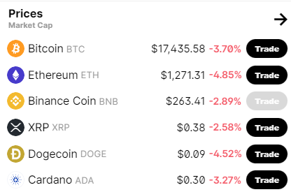
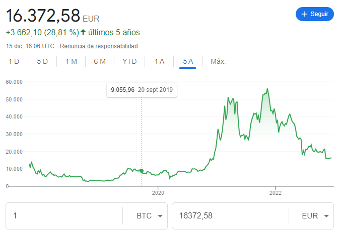
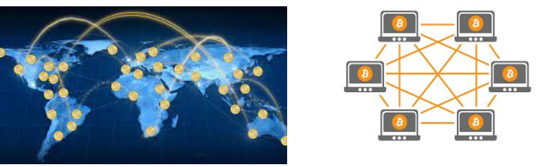
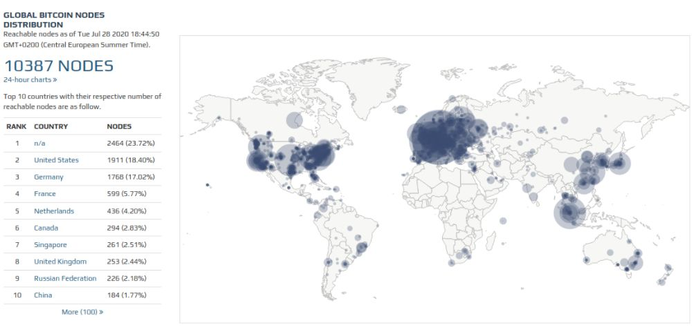
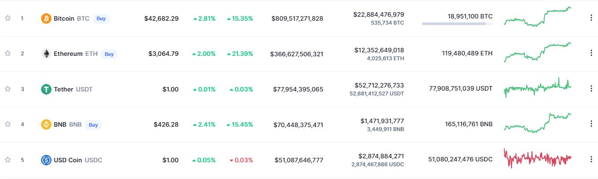
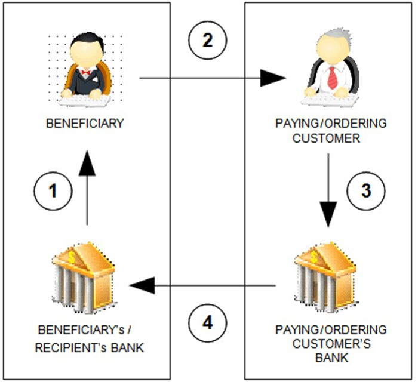

# Criptomonedas

¿Conocéis a alguien que tenga ``Bitcoin`` u otro tipo de criptomoneda?
¿Qué pensáis que es una criptomoneda?

Bitcoin es a la vez el nombre de una red de ordenadores y el nombre de la moneda digital o criptomoneda.

## ¿Qué son las criptomonedas?

Una criptomoneda es una **moneda digital** diseñada para funcionar como un medio de intercambio que utiliza principios de **cifrado** para asegurar las transacciones financieras, controlar la creación de unidades adicionales y verificar la transferencia de activos.

Son activos digitales que se pueden usar para realizar **transacciones** financieras, como **comprar y vender** bienes o servicios. Están respaldadas por tecnologías de cadena de bloques o **blockchain**, que son una forma segura y distribuida de almacenar y transferir datos.

## ¿Qué criptomonedas existen?

Existen muchísimas criptomonedas, cada una con una forma de funcionar ligeramente diferente. Cualquiera puede crear una criptomoneda. Las criptomonedas más populares son **Bitcoin**, **Ethereum**, Ripple, Litecoin, **Cardano**, ``Bitcoin`` Cash y Tether.

Aquí podéis ver el valor actual de algunas criptomonedas (2022):

## ¿Por qué se han vuelto tan populares?

Las criptomonedas se han vuelto tan populares debido a la facilidad y rapidez con la que se pueden realizar transacciones financieras. Además, el hecho de que las criptomonedas sean completamente digitales las hace muy atractivas para el público en general.

Por último, existe un fuerte componente especulativo que ha provocado la entrada en el mercado de muchos inversores.

En los últimos tiempos, el valor de ``Bitcoin`` y otras criptomonedas ha disminuido considerablemente.

## Sistema financiero actual

- Bancos centrales y Gobiernos controlan cantidad de monedas en el mercado
- Las transferencias se realizan a través de bancos
- Sistema monetario protegido y respaldado

## ¿Por qué se inventan las criptomonedas?

- Busca ofrecer un sistema de dinero digital entre ordenadores (P2P)
- Eliminar a los intermediarios del comercio online
- El sistema está formado por muchos ordenadores en todo el mundo
- Estos ordenadores se conectan entre ellos a través de internet
- Comparten la información de las transacciones entre ellos

## ¿Qué hacen los ordenadores que están en esta red?

- Los ordenadores crean las monedas periódicamente
- Comparten entre ellos toda la información
- Si un ordenador se apaga, el resto siguen funcionando

## Nodos de ``Bitcoin``

## ¿Cómo hacer que sea seguro?

- La red de ``Bitcoin`` está "garantizada" por algoritmos criptográficos
- Cada cuenta tiene asociadas unas claves que solo tiene el propietario de la cuenta
- Los ordenadores verifican y protegen la red
- A cambio, estos ordenadores reciben recompensas en forma de criptomoneda
- Si se pierden las claves, se pierde el acceso al dinero

## Criptomonedas

- El control de esta moneda no depende de bancos, entidades o gobiernos
- Las transferencias se realizan entre ordenadores directamente
- Estos ordenadores guardan la información financiera
- Criptomonedas. Han existido desde 1980. Los primeros, Digicash y Ecash
- Fallaron porque no proporcionaron una solución al problema del "doble gasto"

Bitcoin (2009) resuelve el problema
A partir de entonces, aparecen muchas más criptomonedas.

¿De qué depende el valor de una criptomoneda?
El valor de la moneda depende de la oferta y la demanda

## ¿Qué beneficio aportan las criptomonedas?

- Reduce el coste de transacción
- Reduce tiempo de transacción
- Elimina la necesidad de agentes financieros

## ¿Qué problemas generan las criptomonedas?

Las criptomonedas han experimentado un rápido crecimiento en los últimos años, pero todavía hay muchos desafíos a los que se enfrentan. Estos incluyen la falta de control y legislación, la alta especulación, el sistema en desarrollo y la dificultad de operar con criptomonedas en el mundo real.

A medida que la tecnología avanza, estas barreras se van reduciendo. No obstante, aún queda mucho por hacer para que las criptomonedas sean aceptadas a nivel mundial.

