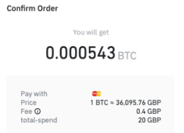

# Exchange

Un **exchange** de criptomonedas es una plataforma en línea que permite a los usuarios comprar, vender y intercambiar criptomonedas por otras criptomonedas o por monedas fiduciarias como el dólar estadounidense. Los exchanges de criptomonedas se parecen a los corredores de bolsa tradicionales, ya que permiten a los usuarios comprar y vender activos financieros. Sin embargo, en lugar de acciones, bonos u otros instrumentos financieros, los exchanges de criptomonedas ofrecen criptomonedas como ``Bitcoin``, Ethereum y Litecoin. Binance es una de las plataformas de intercambio de criptomonedas más populares en el mundo.

## Tarifas

Los exchanges suelen cobrar una **tarifa** o **fees** por cada transacción que se realiza en su plataforma. Algunos exchanges también ofrecen servicios adicionales, como billeteras digitales, para almacenar y proteger las criptomonedas de los usuarios.

Las exchanges tienen unas tarifas diferentes dependiendo del tipo de transacción que realices y de la criptomoneda que estés negociando.

En general, **Binance** cobra una tarifa del 0,1% por transacción para la mayoría de las operaciones de compra y venta. Esta tarifa se aplica tanto a las operaciones realizadas en el mercado como a las operaciones realizadas mediante el uso de órdenes limitadas.

## Regulación

Es importante tener en cuenta que los exchanges de criptomonedas **no están regulados** de la misma manera que los mercados financieros tradicionales, por lo que hay un mayor riesgo de fraude y robo de criptomonedas. Es importante investigar a fondo antes de utilizar un exchange y asegurarse de que es seguro y de confianza.