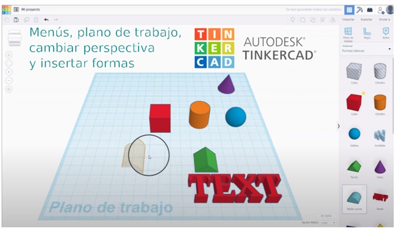

## Vídeo primeros pasos

Aquí tenéis un pequeño vídeo donde os explico brevemente los menús, plano de trabajo, cambiar perspectiva e insertar formas en Tinkercad. Por favor, miradlo antes de comenzar con las prácticas porque os ayudará a moveros por el programa.

## PRIMEROS PASOS

Como en otros programas, podemos hacer y rehacer cambios: +Ctrl++Z+ y +Ctrl++Y+

## El plano de trabajo1

Todo lo que hagamos se coloca en el plano de trabajo. Es un plano cuadriculado de color azul. Sobre él colocaremos los objetos. La rejilla tiene un tamaño por defecto de 1mm, que se puede cambiar. Cada cuadrado grande representa 1 cm, y el plano completo ocupa 20 x 20 cm.

## Cambiar la perspectiva

Podemos cambiar nuestro punto de vista del proyecto de varias formas:
Para moverse alrededor del plano: Botón derecho apretado y mover ratón
Moverse por el plano: Pulsar rueda central del ratón y arrastrar
## Hacer zoom: 

+ o -, o rueda del ratón

Centrar vista en los objetos seleccionados: F

## Cambiar el plano de trabajo

Si queremos que un objeto se coloque justo encima de otro, podemos cambiar el plano de trabajo.

Con la tecla +W+ y luego hacer clic en la superficie en la que queremos colocar el plano.
A partir de ahora, las figuras que coloquemos se colocarán encima de este plano.
Para quitarlo, hacemos clic en un lugar fuera del plano.

## Figuras

Podemos colocar una figura en el plano de trabajo arrastrándolas y soltándolas sobre el plano de trabajo

Para mover la figura:

- Flechas: Flechas de dirección del teclado para mover la figura seleccionada en los ejes X, Y. Las figuras se mueven de 1 en 1 mm.
- +Ctrl++flechas+: Para subir y bajar verticalmente la figura, +Ctrl+ + flechas de dirección del teclado.
- Apretar también +shift+ para mover de 10 en 10 unidades

## Cambiar colores

Podemos cambiar color y propiedades Alternar entre sólido y hueco (+S+ o +H+). El color no afecta demasiado porque luego se imprimirá del color del plástico que tengamos.

Cuando queremos que un objeto no se cambie, podemos bloquearlo con: +Ctrl++L+

Para hacer una copia de la figura, podemos duplicarla: +Ctrl++D+
## Seleccionar figuras

- Seleccionar solo algunas figuras: Mantener +shift+ apretado y seleccionar las figuras una a una
- Seleccionar todas: +Ctrl++A

## Agrupar figuras

- Seleccionar varias figuras y +Ctrl++G+
- Desagrupar +Ctrl++shift+G+
- Alinear varias figuras
 (seleccionándolas previamente) con +L+

## Voltear figura

La función espejo (+M+) nos permite reflejar o voltear el objeto.

## Colocar Regla

Pulsando +R+ y pulsar dónde queremos colocar la regla en el plano de trabajo. La podemos eliminar o mover cuando queramos