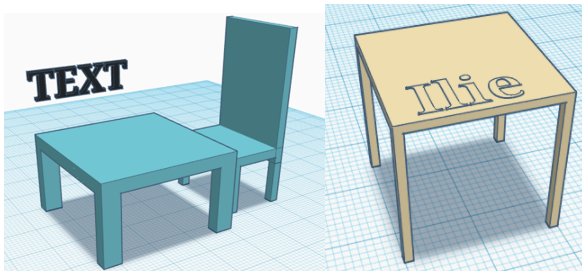

# 1.3 Práctica mesa

Esta práctica es la más sencilla, y os enseñará a crear cubos, cambiar su tamaño y alinearlos. También, gracias a las formas huecas, podréis crear agujeros en otras figuras.

[Práctica mesa](https://ateneu.xtec.cat/wikiform/wikiexport/cmd/tac/tec3d/tkc/combinant_figures/activitat2)

## Personalización

A continuación, podéis ver algunas ideas de personalización de vuestra mesa que podéis probar en vuestros proyectos:

