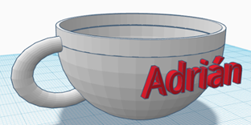

# 1.4. Práctica taza

Tenéis que intentar que se parezcan lo máximo posible a la figura original. 

Tenéis que insertar un bloque de texto con vuestro nombre (solo nombre) en el modelo, para que se vea que lo habéis hecho vosotros.

Para entregar las tareas deberéis compartir una captura de pantalla en la que se vea la figura que habéis realizado

[Práctica taza](https://ateneu.xtec.cat/wikiform/wikiexport/cmd/tac/tec3d/tkc/combinant_figures/activitat3)

Aquí podéis ver algunos diseños de otros compañeros. Algunos incluso han querido personalizar la taza y adaptarla a su gusto.

