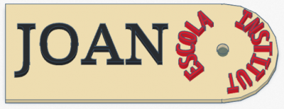

# 1.5. Práctica llavero

Crearemos un llavero utilizando formas de letras y rotaciones.

👉 https://ateneu.xtec.cat/wikiform/wikiexport/cmd/tac/tec3d/tkc/text/activitat2

Ejemplos de compañeros de cursos anteriores:

