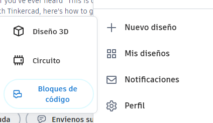
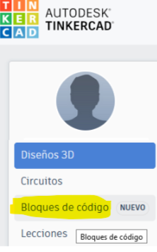
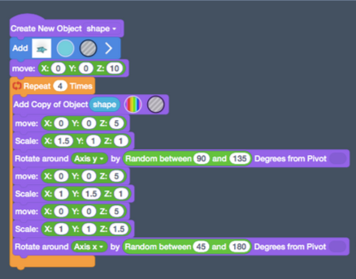

# 1.9. Tinkercad Codeblocks

Tinkercad nos permite crear diseños figuras en 3 dimensiones a partir de objetos simples en 3 dimensiones, combinándolos de diferentes formas.

Estos diseños se pueden automatizar mediante **bloques de programación**, de un modo similar a scratch.

Un programa es un conjunto de instrucciones, como una receta. Estas instrucciones le dicen a la computadora qué hacer. Los informáticos diseñan nuevos programas informáticos, estudian y resuelven problemas y crean nuevas formas de utilizar la tecnología.

## ¿Qué podemos hacer con Tinkercad codeblocks?

Tinkercad **codeblocks**, también llamados «bloques de código» nos permite utilizar bloques de programación. Esto es especialmente útil cuando queremos reproducir ciertos patrones muchas veces.

## Patrones

Los **patrones** son diseños que se repiten o secuencias de elementos recurrentes. Estos patrones no tienen que ser siempre exactos, sino que pueden ir variando en cada repetición.

Si suponemos que tenemos unos conocimientos mínimos de cómo se crea un programa, los elementos más importantes que debemos tener en cuenta son:

- Los **bucles** o loops, que me permiten repetir una acción todas las veces que quiera
- Las **variables**, que pueden contener información que puedo cambiar cuando quiera

## Ejemplo de programa creado con Tinkercad codeblocks

Aquí podemos ver un ejemplo de programa. En lugar de escribir texto, nos dan unas «piezas» o **bloques** ya creados que se pueden conectar entre ellas, como si de un puzzle se tratara, al estilo de **scratch**.

Se lee el programa y se siguen las instrucciones de arriba a abajo, una por una (a excepción de los bucles u otras estructuras de control)

## Colores de bloques

Los colores identifican el tipo de pieza de la que se trata. En este ejemplo:

- Los violetas son movimientos
- Los verdes son variables, que se pueden poner en ciertos «huecos» que hay en otros bloques.
- Los azules colocan nuevas piezas
- Los naranjas son bucles o estructuras que cambian el orden normal del programa, u hacen que se repitan ciertas acciones.

## Ejemplo

Una vez diseñado el programa lo podemos arrancar e irá creando el diseño que nosotros le hayamos dicho, paso por paso, hasta terminar todas las instrucciones.

Podemos cambiar incluso la velocidad, e ir parando el programa en cualquier momento para poder ver cómo se va desarrollando. Si algo no nos gusta o no funciona, podemos cambiar instrucciones o valores de variables y volver a ejecutarlo.