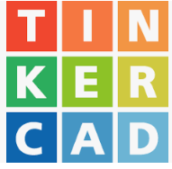
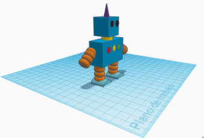
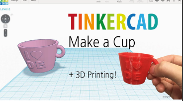

[🔙 Enrere](../) | [🏠 Pàgina principal](http://danimrprofe.github.io/apuntes/)

# Tinkercad

Tinkercad és un programa de disseny en 3D que permet crear models digitals d'objectes en tres dimensions de manera senzilla i intuitiva, sense la necessitat de tenir coneixements previs de disseny 3D.

Es pot accedir en aquest enllaç: https://www.tinkercad.com/

Amb Tinkercad es poden dissenyar objectes des de zero utilitzant eines de modelatge com extrusió, arrodoniment, fusió, etc. També es poden importar models des d'altres programes de disseny i modificar-los en Tinkercad.

Un cop s'ha creat el model en Tinkercad, es pot exportar en diferents formats per al seu ús en altres programes o per imprimir-lo en una impressora 3D.

## Prácticas

- [11_tinkercad](./1.1._tinkercad.md)
- [12_primeros_pasos](./1.2._Primeros_pasos.md)
- [13_práctica_mesa](./1.3._Práctica_mesa.md)
- [15_práctica_llavero](./1.5._Práctica_llavero.md)
- [16_práctica_among_us](./1.6._Práctica_among_us.md)
- [17_texto_alrededor_de_curva](./1.7._Texto_alrededor_de_curva.md)
- [18_casa](./1.8._Casa.md)
- [19_tinkercad_codeblocks](./1.9._Tinkercad_codeblocks.md)
- [20_cohete](./2.0._Cohete.md)
- [21_portavelas](./2.1._Portavelas.md)
