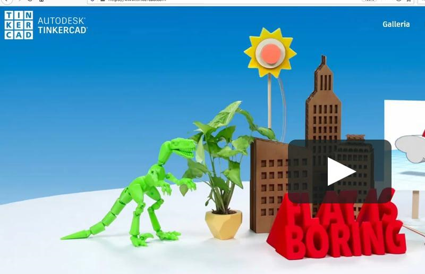

# Tinkercad

Tinkercad es un programa de diseño en 3D que tiene múltiples aplicaciones. Podemos diseñar con él cualquier figura y, si queremos, imprimirla utilizando una impresora 3D.

Podéis acceder a Tinkercad aquí 👉 https://www.tinkercad.com/

markdown-index directory/fulla/markdowns > index.md

## Prácticas

- [11_tinkercad](./1.1._tinkercad.md)
- [12_primeros_pasos](./1.2._Primeros_pasos.md)
- [13_práctica_mesa](./1.3._Práctica_mesa.md)
- [15_práctica_llavero](./1.5._Práctica_llavero.md)
- [16_práctica_among_us](./1.6._Práctica_among_us.md)
- [17_texto_alrededor_de_curva](./1.7._Texto_alrededor_de_curva.md)
- [18_casa](./1.8._Casa.md)
- [19_tinkercad_codeblocks](./1.9._Tinkercad_codeblocks.md)
- [20_cohete](./2.0._Cohete.md)
- [21_portavelas](./2.1._Portavelas.md)

