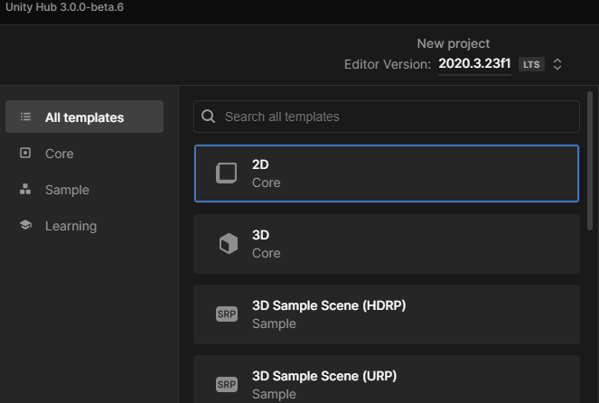

# 02. Crear un proyecto

Le damos a lo que tenemos por aquí y vamos a seleccionar lo importante es el template 2d que básicamente vamos a hacer el juego en 2d

El proyecto el nombre pues le ponéis el que queráis yo los voy a poner por tutorial de hecho ya lo tengo creado así que no me dejaba ponerle el mismo nombre y seleccionar pues una localización y cuando lo tenga listo pues le das a create
