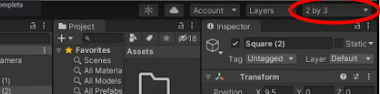

# 03. Cambiar layout de ventanas

Vamos a cambiar el **layout** así a mí así no me gusta trabajar tengo una distribución de ventanas que ya esté acostumbrado y que siempre pues es la que me pongo para cambiar esto lo que podéis hacer es iraquí arriba y seleccionar puede ser que vosotros se os adapte más a vuestra forma de trabajar y si bien ha visto ha bajado nunca pues yo que se lo recomiendo que voy a utilizar es la de **2 by 3**.

