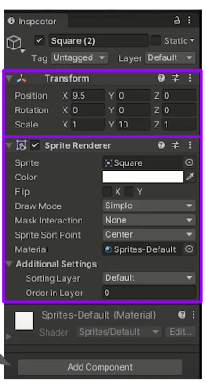

# 04. Sprites

Un sprite es una imagen bidimensional que se utiliza como elemento gráfico en un videojuego. Se dibuja con herramientas de gráficos vectoriales o bitmap y se usa para representar personajes, objetos, entornos o cualquier otra imagen.

En Unity, los sprites se usan para crear gráficos 2D, como personajes, fondos, objetos y cualquier otra imagen que se use en un juego 2D. Estos sprites se pueden importar directamente desde un archivo de imagen o se pueden crear desde cero usando Unity.

Los sprites se almacenan en el formato .PNG y se pueden manipular fácilmente en Unity. Los sprites se pueden mover, girar, escalar y rotar fácilmente con Unity. También se pueden usar para crear animaciones y efectos especiales.

## Componente transform

Todos los objetos por defecto tienen una posición y un tamaño\. Esto se cambia en el componente   __T__    __ransform__  \.
