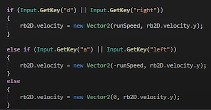
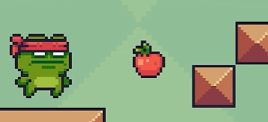

# Plataformas 2D

Importar package de asset store (pixel adventure 1)

## Crear tilemap

Un Tilemap es una herramienta de Unity que permite crear ambientes de juego mediante el uso de gráficos tiles. Esta herramienta proporciona una manera fácil y eficiente de organizar, crear y modificar grandes áreas de juego usando una variedad de gráficos tiles.

## Crear paleta y pintar la escena

## Asignar collider al tilemap

Para asignar un collider al tilemap, primero necesitamos habilitar el tilemap colisiones en el editor de Unity. Esto se puede hacer en el inspector del tilemap, seleccionando la carpeta "Tilemap Collider 2D". Luego, seleccione todas las capas de su tilemap y active la casilla "Generar Colliders". Esto generará automáticamente un collider en el tilemap.

## Asignar rigidbody al personaje

## Crear movimiento lateral del personaje

Colocar collider al personaje y modificarlo

## Crear salto del personaje

Necesitaremos un script que compruebe que el personaje está tocando suelo:

En el script de movimiento del personaje, comprobaremos que pulsamos espacio y, además, que estamos tocando suelo:

Cambiar material del tilemap para reducir rozamiento y evitar flotar

Crearemos un material para el mapa, que tendrá 0 fricción, por lo que el personaje se moverá con más suavidad y evitaremos que se enganche a él.

## Mejorar el salto (betterjump)

Nos tocará crear un boolean para activar un salto mejorado, que dependerá del tiempo de pulsación de la tecla, pudiendo saltar más o menos.

## Recolección de fruta con animación

Habrá que crear un script que detecte la colisión de la manzana con el player, se va a llamar FruitCollected, y posteriormente destruir el objeto manzana. Este script se lo asignaremos luego a todas las frutas.

