## 4. Crear pelota

Dentro de nuestra ventana lo que vamos a hacer es ``clic derecho`` y darle a spritesquare y como veis pues directamente seme pone pues un cuadrado que es el quevamos a utilizar para la bola.

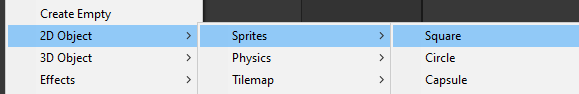

---

## Crear jugadores

Para los jugadores para las paredes para todoporque vamos a poder pues escalarlo enlos diferentes ejes y pues nos va aayudar a crear por como comentó el juegoen sí vamos a necesitar ni bajarnosninguna se ni nada va a ser todochocaron aquí en juniti así que buenogenera seguido un primer momento vamos acrear las paredes de arriba y de abajoentonces para ello

1. Vamos a la escala y vamos a colocarla en el eje x alo que sería un valor de 18
2. Ahora vamos a colocarlo en la posición 0 y 0 en el eje x y y
3. Ahora lo que vamos ahacer es subirlo hacia arriba para ello
4. También podéis pulsar +w+ cuando tengáis este objeto seleccionado y entonces pues podréis moverlo en ese eje en específico.

---

## Duplicar objetos

Podemos ``duplicar`` un objeto en lugar de crear uno nuevo. este que tenemos y ponerlo pues abajo del todo para ello pues lo que podéis hacer es control de o ``clic derecho > duplicate`` se duplicará y ahora lo único que tenemos que hacer es en vez de ir arrastrando lo va a estar en la posición contraria a 5 en este caso pues sería menos 5 a esta

---

## 05. Sprites

Un ``sprite`` es una imagen bidimensional que se utiliza como elemento gráfico en un videojuego. Se dibuja con herramientas de gráficos vectoriales o bitmap y se usa para ``representar personajes, objetos, entornos`` o cualquier otra imagen.

---

Estos ``sprites`` se pueden importar directamente desde un archivo de imagen o se pueden crear desde cero usando ``Unity``.

Los ``sprites`` se pueden mover, girar, escalar y rotar fácilmente con ``Unity``. También se pueden usar para crear animaciones y efectos especiales.

---


Todos los objetos por defecto tienen una posición y un tamaño\. Esto se cambia en el ``componente Transform``

---

## 06. Crear paredes de los lados

A partir de un jugador:

1. ``duplicar`` el objeto
2. Escalar hasta colocarlo como toca

Si pulsáis la ``rueda`` del ratón podéis hacer una especie de ``paneo``.

---

Ahora lo que quedaría es ponerlo a la derecha y ala izquierda entonces en este caso lo que vamos a hacer es poner en la posición de y a 0 y aquí vamos a modificar la posición en el eje x en este caso la podemos poner por ejemplo en ocho y más o menos vemos que se queda cerca de lo que sería pero estas paredes no se tienen que ver tienen que estar por la parte de fuera.

---

Vamos a colocar pues por ejemplo ahí lo quesería pues yo creo que el nueve y medio va bien estas paredes van a ser diferentes a esta nueva entre colisión en el hecho de que no van a hacer que rebote la pelota sino que cuando colisionan con esta pared va a ser como la portería de un jugador o del otro y entonces pues se añadirá un punto cuando colisiones perfecto

---

### Crear segunda pared

Podemos ``duplicar`` el objeto. y ponerlo en el lado contrario que simplemente poniéndole un negativo en el 9,5 pues se pondrá justo en el otro lado.

---

## 07. Nombrando los objetos

Ahora importante nombrar las cosas porque vamos a empezara tener muchos ``objetos`` y nos podemos confundir. Además, deberemos poder identificarlos en los ``scripts`` que crearemos para manipularlos.

Para renombrar un objeto hacéis doble clic o con ``F2``. La portería derecha vamos a llamarle en ``goal1`` porque va a ser la portería en la que tiene que colar el jugador 1 que va a estar a nuestra izquierda.

---

## 08. Creando los jugadores

Vamos a crear los ``players``. entonces vamos a hacer control de sobre ese amigo aquí de la derecha lo voy a arrastrar a esta posición que de hecho lo vamos a poner en la posición 8 y ahora hay que reducir la escala. Así imaginaros que vuestro ``player`` es así de grande en 3 cuando venga la bola va a rebotar sí o sí, al ser demasiado grande.

---

### Crear ``jugador2``

Vamos a reducirlo unpoco a lo que sería en el eje y a 2.5 luego pues podemos modificar elmovimiento de la velocidad de la bolapodemos modificar muchas cosas pues paraque se adapte a lo que cada uno puesesté buscando en este caso como está ala derecha pues lo llamaremos player2.

---

### Crear jugador 1

Duplicamos el jugador con ``Ctrl``+``D`` y lo llevamos a la posición contraria

---

# Pelota

Ahora lo único que ayudaría sería pues nuestra ``pelota`` del medio así que podemos hacer directamente clic derecho dentro de nuestro ``Unity`` su día dietsprite square y si la colocamos en el 0,0.

---

Para poder diferenciar lo mejor vamos a cambiarle el color y esto lo podéis hacer con todos los objetos

---

## 09. Componentes rigidbody

``Rigid Body 2D`` es un componente de ``Unity`` que se utiliza para añadir físicas a un objeto 2D. Un ``Rigid Body 2D`` le permite a un objeto 2D afectado por la gravedad, el empuje, la fricción y otras fuerzas físicas. Esto permite a los desarrolladores añadir realismo y jugabilidad a los juegos 2D.

Asignaremos los componentes ``Rigidbody 2D``  a nuestros jugadores y a la pelota. Podemos seleccionar todos los objetos y seleccionar el componente ``Rigidbody 2D``  para añadirlo.

---

### Modificar gravedad

Al dar a ``play`` los objetos con Rigidbody caerán, pues sobre ellos actúa la gravedad. Para quitarles el efecto de la gravedad, donde pone gravity podemos ponerlo a 0 y así ya no se caerán.

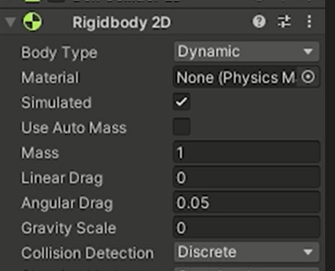

---

Los ``rigidbodies`` son componentes que añadiremos a nuestros ``players`` y para nuestra ``pelota`` y se encargarán del tema de física para el movimiento.

- Vamos a seleccionar nuestro ``player`` y nuestra ``bola``.
- A continuación seleccionamos todos en el componente ``Rigid Body 2D`` y ahí le añadimos.

---

Si dejamos esto así tal cual cuando yo le diera el ``play`` vais a ver qué los elementos caen. Esto es porque tienen física y por tanto, les afecta la gravedad. En nuestro caso esto no lo queremos.

Lo que tenemos que hacer es dentro de nuestro componente ``Rigid Body 2D``  donde pone ``gravity`` es que a uno vamos a ponerlo a 0 y así ya no se caerán.

---

## 10. Ordenar objetos

tra cosa que modificando que a lo mejor les ocurre es que la línea del centro se está dibujando por encima de nuestra pelota yeso pues la verdad que no queda muy buena lo mejor sí a lo mejor lo queréis vale pues lo dejáis lo dejáis así si os gusta pues lo dejáis pero si no lo que podéis hacer es se detiene al puesto al bola

---


---

En el elemento ``sprite renderer`` podemos cambiar el orden. Esto sirve para diferenciar la altura a la que se dibujan las diferentes elementos dentro de nuestra pantalla porque ahora mismo son todo imágenes entonces para saber diferenciar cuál está por delante de una de otra utilizamos el orden y léger\. __

__Podemos poner un 2 ya se dibuja por encima así que así no habrá problema\.__

La ``línea del centro`` se está dibujando por encima de nuestra ``pelota``.

Para modificarlo, seleccionamos el objeto ``bola`` y en el elemento ``Sprite Renderer`` en el ``orden`` ponemos un número más alto. Esto sirve para diferenciar la altura a la que se dibujan las diferentes elementos dentro de nuestra pantalla. Ahora la ``bola`` se dibuja por encima.

---

## 11. Movimiento de personajes

Ahora vamos a pasar directamente a lo que sería el tema de los movimientos de nuestros personajes. Vamos a hacerlo con:

- Teclas ``w`` y ``s`` para el ``jugador1`` (izquierda)
- Teclas flecha de arriba y hacia abajo para el ``jugador2`` (derecha)

De este modo, podremos jugar 2 jugadores en el mismo teclado.

---

<!-- _class: invert -->
# <!--fit --> CONTROLES
---

Los ``controles`` son las teclas que utilizaremos para las diferentes acciones durante el juego.

---

## Redefinir controles

Para redefinir los controles, vamos a ir a ``Edit > Project Settings > Input Manager``. Aquí vemos que hay varias cosas declaradas, como ``Axes``. Estos son los controles que ``Unity`` tiene asignados por defecto para las teclas de nuestro teclado.

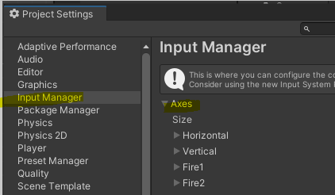

---

Por ejemplo, para el eje **horizontal**, está asignado a las teclas de flechas o el número 'A' para izquierda y derecha.

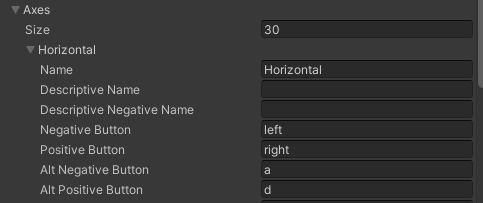

---

Para el eje **vertical**, está asignado a las teclas de W, A, S y D, y las flechas de arriba y abajo. Así que si queremos cambiar estos controles, podemos hacerlo en el Input Manager.

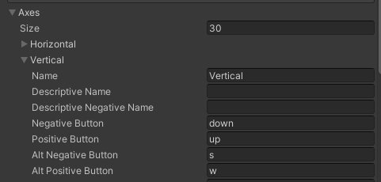

---

## Controles para segundo jugador

Tenemos que crear el elemento ``vertical2`` que es para nuestro ``player2``. Tenemos que diferenciar pues que uno utilice el WS y el otro utilice la flecha hacia arriba y hacia abajo. Lo tenemos que diferenciar entonces lo que vamos a hacer es del vertical vamos a borrar el SW que tenemos aquí. Vamos a duplicarlo para tener un vertical2 para nuestro jugador 2; clic
derecho duplicate element y se duplicará que vendrá por aquí otra como vertical y lo llamamos vertical2.

---

Lo que faltaría es cambiarle los controles del player1 juega con la flecha de arriba y hacia abajo. Nosotros con el jugador 2 jugaremos con la W y S. En negativo ponemos S y en positivo W. Dentro del objeto player, en función de si es el 1 o el 2, seleccionaremos el control oportuno.


---

## Dentro de los scripts, podemos acceder a los diferentes controles por su nombre


---
<!-- _class: invert -->
# <!--fit --> SCRIPTS
---

## 13. Script de programación

Los ``scripts`` son pequeños programas que controlan el comportamiento de los objetos y la dinámica del juego en ``Unity``.

Estos se crean utilizando el ``lenguaje C#``  y se guardan en archivos con extensión ``.cs``. Para editarlos se utiliza Visual Studio Code, y se guardan dentro de la carpeta ``assets``.

---

Dentro dela carpeta ``assets`` vamos a hacer clic ``derecho > new folder`` que vamos a llamar ``scripts`` y así tendremos guardados todos nuestros programas en esta carpeta. Para crear un ``script``, hacemos clic derecho en la carpeta y elegimos la opción ``create C# script``.

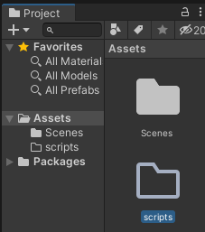

---

Ahora vamos a pasar a crear nuestro script vamos aquí a entrar a la carpeta que acabamos de crear y vamos a hacer ``clic derecho > create C# script``. A este script le vamos a llamar ``Player.cs``. Podríamos abrirlo y vamos a utilizar el programa visual studio.

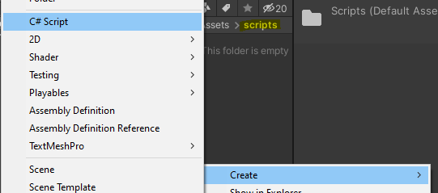

---

### Estructura de un script

Los scripts en ``Unity`` tienen una estructura básica compuesta por dos partes principales: la parte de declaración de variables, y las funciones.

La parte de **declaración de variables** es donde se definen los campos, variables y propiedades que se usarán en el script.

---

La segunda parte es la **sección de funciones**, donde se escribe el código que controla el comportamiento de objetos en el juego.

- La función ``Start()`` se llama al comienzo del juego (una vez) y generalmente se usa para inicializar variables y configurar el estado inicial del objeto.
- La función ``Update()`` se llama una vez por frame y se usa para actualizar el estado del objeto.

---

Además de estas dos funciones, podemos crear todas las funciones que queramos para controlar el comportamiento de un objeto, desde eventos de entrada (como cuando un usuario presiona una tecla) hasta eventos de salida (como cuando un objeto sale del juego). Estas funciones se pueden llamar en el script para ejecutar el código deseado.

```c#
using System.Collections;
using System.Collections.Generic;
using UnityEngine;

public class NewBehaviourScript : MonoBehaviour
{
    // Start is called before the first frame update
    void Start()
    {

    }

    // Update is called once per frame
    void Update()
    {

    }
}
```

---

### Errores de programación

Los errores de programación más comunes en ``Unity`` son errores de sintaxis. Estos se producen cuando el programador escribe algo de forma incorrecta, por ejemplo, olvidarse de poner ; al final de las líneas o cerrar un \}, o escribiendo mal mayúsculas o minúsculas.

---

Si hay errores de sintaxis, ``Unity`` no podrá ejecutar el juego correctamente, por lo que el programador debe solucionar los errores antes de poder continuar.

Algunas de las formas más comunes de solucionar estos errores son comprobar el código con cuidado, revisar la documentación para asegurarse de que está escribiendo cada línea correctamente

---


---

### Crear script players

```c#
using System.Collections;
using System.Collections.Generic;
using UnityEngine;

public class Players : MonoBehaviour
{

    public bool player1;
    public float speed = 3;
    public Rigidbody2D rb;

    private float move;
    private Vector2 startPos;

    void Start()
    {
        startPos = transform.position;
    }
    void Update()
    {
        if(player1)
        {
            move = Input.GetAxisRaw("Vertical");
        }

        else
        {
            move = Input.GetAxisRaw("Vertical2");
        }

        rb.velocity = new Vector2(rb.velocity.x, move*speed );
    }
    public void Reset()
    {
        rb.velocity = Vector2.zero;
        transform.position = startPos;
    }
}
```

---

## 14. Asignar script al jugador

Para que un script tenga efecto, hay que ``asignar`` el script a uno o más objetos. Para ello los scripts se arrastran y sueltan sobre los objetos que queremos que los utilicen.

Cada vez que volvamos a ``Unity`` después de modificar nuestros scripts, se recargará el proyecto para incluir los cambios.

En el caso de haber errores de programación, deberemos primero subsanarlos.

Una vez terminado, podemos asignar el script ``player.cs`` a los objetos ``player1`` y ``player2``, arrastrándolos y soltándolos sobre estos objetos.

---

## Cambiar el booleano para player2

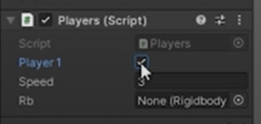

---

## Asignar rigidbody al script

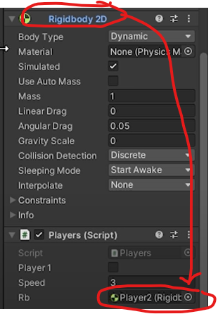

---

## Crear método reset en el script

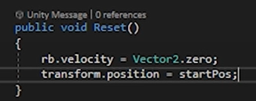

---

## Crear script para la pelota

Crearemos un script para la pelota al que llamaremos ``ball.cs``.

```c#
using System.Collections;
using System.Collections.Generic;
using UnityEngine;

public class Goal : MonoBehaviour
{
    public bool player1Goal;
    public GameObject gameManager;

    private void OnTriggerEnter2D(Collider2D collision)
    {
        if(collision.CompareTag("Ball"))
        {

            if (player1Goal)
            {
                gameManager.GetComponent<GameManager>().Player1Scored();
            }

            else
            {
                gameManager.GetComponent<GameManager>().Player2Scored();
            }
        }
    }
}
```

---

## Asignar script a la bola

---

## Asignar el rigibody

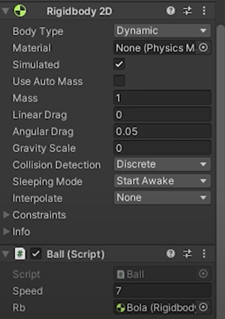

---

## Crear material para la pelota

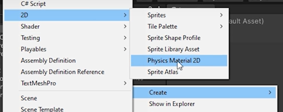

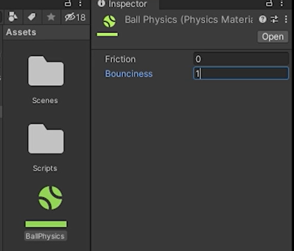

---

## Restringir movimientos en los players

Solo queremos que los jugadores se muevan en un eje, por lo que restringimos los otros dos.

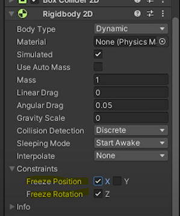

---

## Reorganizar archivos

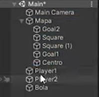

---

## Crear interfaz puntuación

Crearemos las puntuaciones. Al crear una UI, este objeto se nos pondrá dentro de una carpeta ``canvas``.

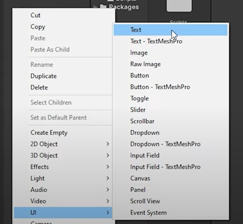

---

## Cambiar posición

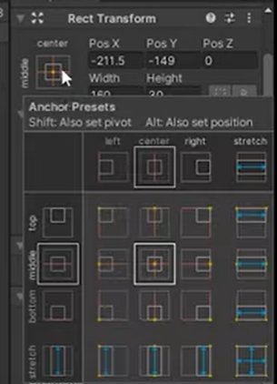

Una vez creado el texto y colocado, lo duplicaremos para tener dos objetos texto, a los que modificaremos el nombre y se llamarán ``Player1Text`` y ``Player2Text``.

---

## Cambiar pelota y hacerla redonda

En el ``Sprite Renderer`` tenéis que cambiar la propiedad ``Sprite`` por un círculo.

---

## Crear el script del juego

Crearemos un ``script`` que llamaremos ``GameManager`` (veréis que cambia el icono por un engranaje).

Borraremos los métodos ``start()`` y ``update()``.

Crearemos los métodos ``Player1Scored()`` y ``Player1Scored()``.

Al marcar un gol:

1. La pelota vuelve al centro
2. Las palas vuelven a su posición iniciar
3. Cambiamos los valores del marcador

``ResetPosition()`` será un método que resteará los objetos.

```c#
using System.Collections;
using System.Collections.Generic;
using UnityEngine;
using UnityEngine.UI;
using UnityEngine.SceneManagement;

public class GameManager : MonoBehaviour
{
    public GameObject bola;
    public GameObject player1;
    public GameObject player1goal1;
    public GameObject player2;
    public GameObject player2goal2;

    public Text player1Text;
    public Text player2Text;

    private int player1Score;
    private int player2Score;

    public bool IAGame;

    public int maxScore = 7;

    public void CheckVictory()
    {
        if(player1Score >= maxScore){
            SceneManager.LoadScene("VictoryPlayer1");
        }

        if(player2Score >= maxScore){
            SceneManager.LoadScene("VictoryPlayer2");
        }
    }

    public void Player1Scored()
    {
        player1Score``;
        player1Text.text = player1Score.ToString();
        CheckVictory();
        ResetPosition();
    }

    public void Player2Scored()
    {
        player2Score``;
        player2Text.text = player2Score.ToString();
        CheckVictory();
        ResetPosition();
    }

    private void ResetPosition()
    {
        if (IAGame)
        {
            bola.GetComponent<Ball>().Reset();;
            player2.GetComponent<Players>().Reset();
        }
        else
        {
            bola.GetComponent<Ball>().Reset();;
            player2.GetComponent<Players>().Reset();
            player1.GetComponent<Players>().Reset();
        }
    }
}
```

---

## Añadir las referencias a objetos

Arrastraremos todos los objetos a las propiedades del script ``GameManager``.

---

## Marcar trigger en las porterías

Necesitamos marcar la opción ``is Trigger`` del componente ``Box Collider 2D``.

---

## Crear script para las porterías

Creamos un script llamado ``Goal.cs``.  Utilizaremos el método ``OnTriggerEnter2D()`` para detectar colisión entre la pelota y alguna de las porterías.

``CompareTag`` comprobará si el objeto que colisiona es la bola y, en caso de ser así, según si colisiona con ``Goal1`` o con ``Goal2`` cambiaremos la puntuación correspondiente.

---

```c#
using System.Collections;
using System.Collections.Generic;
using UnityEngine;

public class Goal : MonoBehaviour
{
    public bool player1Goal;
    public GameObject gameManager;

    private void OnTriggerEnter2D(Collider2D collision)
    {
        if(collision.CompareTag("Ball"))
        {

            if (player1Goal)
            {
                gameManager.GetComponent<GameManager>().Player1Scored();
            }

            else
            {
                gameManager.GetComponent<GameManager>().Player2Scored();
            }
        }
    }
}
```

---

## Asignar scripts

Vamos a asignar el script creado a ``Goal1`` y a ``Goal2`` y marcamos en ``Goal1`` el check player1goal.

---

## Asignar etiqueta a la bola

Necesitamos asignar el ``tag`` que llamaremos ``ball`` al objeto pelota, seleccionando en ``Tag`` y ``Add Tag``.

---

## Crear referencias

Nos hemos dejado crear referencias en el script ``Goal.cs``. Una vez lo hayamos hecho, arrastramos ``GameManager`` a las referencias.

---

## Cambiar colores

Utilizar la página ``coolors`` para elegir paletas.

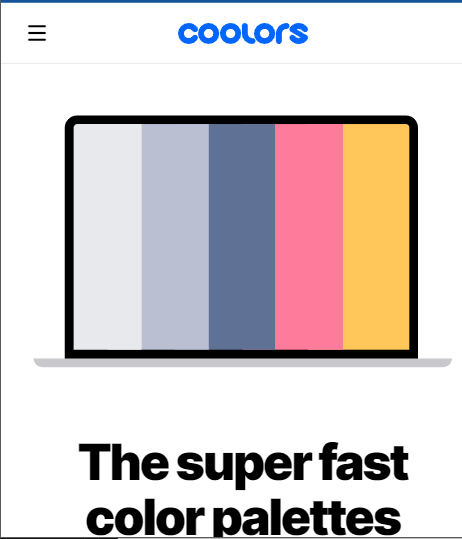

---

## Inteligencia artificial

Vamos a hacer que un jugador sea controlado por la máquina.
Crear el script ``IA.cs`` y la completamos.

---

```c#
using System.Collections;
using System.Collections.Generic;
using UnityEngine;

public class IA : MonoBehaviour
{
    public float speed=3;
    public GameObject ball;
    private Vector2 ballPos;

    void Update()
    {
        Move();
    }

    void Move() {
        ballPos = ball.transform.position;

        if (transform.position.y > ballPos.y)
        {
            transform.position += new Vector3(0, -speed*Time.deltaTime);
        }

        if (transform.position.y < ballPos.y)
        {
            transform.position += new Vector3(0, speed*Time.deltaTime);
        }
    }
}
```

---

Una vez completado el script.

Asignamos el script ``IA.cs`` a ``Player1`` y desamarcamos el checkbox del scripts ``Players`` para que no interfiera.

Arrastramos la referencia de ``Bola`` al script.

Crear variable en ``GameManager`` para decidir si el juego es PvP o PvsPC. Será un booleano. En ``ResetPosition()`` miraremos este valor para decidir resetear o no.

Seleccionar el objeto ``GameManager``  y marcar la opción ``IA Game``.

---
<!-- _class: invert -->
# <!--fit --> ESCENAS
---

## Crear menú

Necesitaremos 3 escenas. Ahora solo tenemos la escena ``Main``. La vamos a llamar ``PlayerVSIA`` para diferenciarla.

La duplicamos y le llamamos ``PlayerVSPlayer``. En esta escena, desmarcamos el check de ``IA Game``.

Creamos una escena 2D nueva yendo a ``File > New scene > 2D``.

---

Las escenas deberán estar todas dentro de la carpeta ``Scenes``. Haciendo clic en cada una de ellas, podremos abrirlas y modificarlas

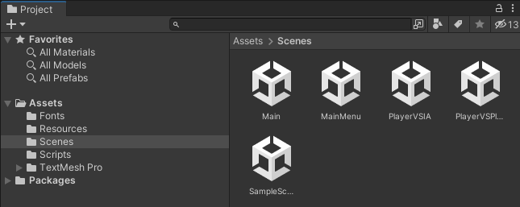

---

### Crear botones

Crear botón. Clic derecho en ``Hierarchy`` y ``Create > UI > Button``.

El botón se hará grande o pequeño según la resolución y el aspect ratio. Si queremos fijar su tamaño, haremos lo siguiente.

Iremos al objeto ``Canvas`` en el que se ha creado el botón y en el componente ``Canvas Scaler`` vamos a la propiedad ``UI Scale Mode`` y elegimos ``Scale With Screen Size``.

Duplicamos el botón y le colocamos el texto ``Player VS Player``. Lo movemos y lo situamos.

---

### Colocar texto con nombre del juego

Pondremos un texto y le cambiaremos el texto por PONG, y lo haremos más grande. Para evitar problemas al hacerlo grande o pequeño, vamos al ``inspector`` y buscamos en paragraph las opciones ``horizontal overflow`` y ``vertical overflow`` y les asignamos el valor ``overflow``.

Lo hacemos grande y lo situamos.

Guardamos la escena (que ahora se llama ``Untitled*``) con +ctrl+ y +s+  y le llamaremos ``MainMenu``.

---

### Crear script MainMenu.cs

```c#
using System.Collections;
using System.Collections.Generic;
using UnityEngine;
using UnityEngine.SceneManagement;

public class MainMenu : MonoBehaviour
{

    void Update()
    {
        if (Input.GetKeyDown(KeyCode.Escape))
        {
            Application.Quit();
        }
    }

    public void PlayerVSIA(){
        SceneManager.LoadScene("PlayerVSIA");
    }

    public void PlayerVSPlayer(){
        SceneManager.LoadScene("PlayerVSPlayer");
    }
}
```

---

### Asignar script al canvas

Tendremos que asignar el script ``MainMenu.cs`` al ``canvas`` de la escena del menú, arrastrándo el ``script`` y soltando encima de ``canvas``.

Seleccionamos ``PlayerVSPlayer``.

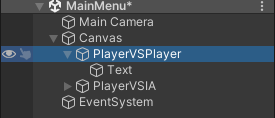

---

Por último tendremos que arrastrar ``canvas`` a las referencias de los dos botones.

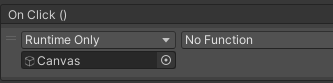

---

Cambiamos el ``onclick`` para que llame a las funciones correspondientes. Elegimos la función ``MainMenu > PlayerVSPlayer``:

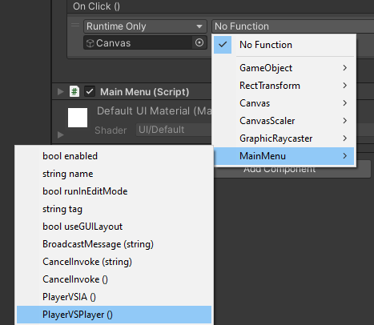

---

### Modificación de build settings

Los ``Build Settings`` permiten a los desarrolladores configurar y compilar proyectos de Unity para distintas plataformas de destino. Tenemos que agregar las escenas que formarán parte en el juego en el orden correcto.

---

Para agregar escenas, sigue estos pasos:

1. Ve al menú ``File`` (Archivo) y selecciona ``Build Settings`` (Configuración de compilación).
2. En la ventana ``Build Settings``, verás una lista de escenas. En la parte inferior deberemos colocar las escenas que van a formar parte de nuestra ``build``.

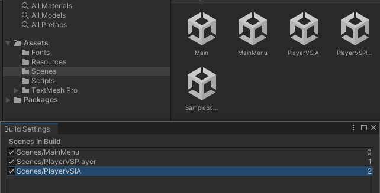

---

### Comprobación

Comprobaremos que ejecutando el juego, podemos pasar del menú a cada una de las dos escenas siguientes.