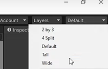

# Juegos con ``Unity``


Estos días estamos dedicando las sesiones a trabajar el desarrollo de videojuegos. Para ello utilizamos el motor ``Unity``, que nos permite crear proyectos 2D y 3D.

Hemos seguido los tutoriales del usuario Luiscanary, para poder desarrollar los proyectos de Pong y un juego de plataformas 2D. A través de estos proyectos hemos aprendido a:

- Crear objetos de sprite 2D y colocarlos en escena
- Programar scripts que, asignados a los objetos, controlen su comportamiento
- Utilizar controles de teclado para mover los objetos
- Asignar componentes rigidbody para agregar respuesta a físicas en nuestros sprites
- Agregar colliders a los objetos para controlar las colisiones entre ellos y modificar el comportamiento del juego.



## Crear pelota

Dentro de nuestra ventana lo que vamos a hacer es clic derecho y darle a judíos el spritesquare y como veis pues directamente seme pone pues un cuadrado que es el quevamos a utilizar para la bola.

Para los jugadores para las paredes para todoporque vamos a poder pues escalarlo enlos diferentes ejes y pues nos va aayudar a crear por como comentó el juegoen sí vamos a necesitar ni bajarnosninguna se ni nada va a ser todochocaron aquí en juniti así que buenogenera seguido un primer momento vamos acrear las paredes de arriba y de abajoentonces para ello

1. Vamos a la escala y vamos a colocarla en el eje x alo que sería un valor de 18
2. Ahora vamos a colocarlo en la posición 0 y 0 en el eje x y y
3. Ahora lo que vamos ahacer es subirlo hacia arriba para ello
4. También podéis pulsar +w+ cuando tengáis este objeto seleccionado y entonces pues podréis moverlo en ese eje en específico.

## Cambiar resolución

Vamos a cambiar la ``resolución`` por la típica que se utiliza en pantallas que es la **16:9** que está se adapta muy bien pues ahora que es 1080 720 dos cada4 acá en ese caso que es la resolución este vertical y horizontal porque mantiene un aspecto de relación que cuadra en ese sentido entonces cuando como veis si yo creo a 18 y pongo esto en la posición de y a 4.5 queda perfectoahí en su posición de hecho es lo quevoy a hacer es ponerlo a 5 ya poner un poco más arriba a mí me gusta más que se vea pero que tampoco me ocupe pues media pantalla esa pared perfecto

Podemos ``duplicar`` un objeto en lugar de crear uno nuevo. este que tenemos y ponerlo pues abajo del todo para ello pues lo que podéis hacer es control de o ``clic derecho > duplicate`` se duplicará y ahora lo único que tenemos que hacer es en vez de ir arrastrando lo va a estar en la posición contraria a 5 en este caso pues sería menos 5 a esta

## Crear paredes de los lados

Para ello pues igual voy a ``duplicar`` el objeto y ahora lo que pasa esque mi escala en el eje x no va a ser sino que va a ser en el eje y entonces en este caso puedo dejar la escala en el eje x a1 y la escala en el eje y a

Si pulsáis la ``rueda`` del ratón podéis hacer una especie de ``paneo``.

Ahora lo que quedaría es ponerlo a la derecha y ala izquierda entonces en este caso lo que vamos a hacer es poner en la posición de y a 0 y aquí vamos a modificar la posición en el eje x en este caso la podemos poner por ejemplo en ocho y más o menos vemos que se queda cerca de lo que sería pero estas paredes no se tienen que ver tienen que estar por la parte de fuera

Vamos a colocar pues por ejemplo ahí lo quesería pues yo creo que el nueve y medio va bien estas paredes van a ser diferentes a esta nueva entre colisión en el hecho de que no van a hacer que rebote la pelota sino que cuando colisionan con esta pared va a ser como la portería de un jugador o del otro y entonces pues se añadirá un punto cuando colisiones perfecto

Podemos ``duplicar`` el objeto. y ponerlo en el lado contrario que simplemente poniéndole un negativo en el 9,5 pues se pondrá justo en el otro lado.

## Nombrando los objetos

Ahora importante nombrar las cosas porque vamos a empezara tener muchos ``objetos`` y nos podemos confundir. Además, deberemos poder identificarlos en los ``scripts`` que crearemos para manipularlos.

Para renombrar un objeto hacéis doble clic o con +F2+. La portería derecha vamos a llamarle en ``goal1`` porque va a ser la portería en la que tiene que colar el jugador 1 que va a estar a nuestra izquierda.

Este otro lado de la izquierda pues sería **goal2** adiós con lage mayúscula perfecto porque íbamos a pasar a hacerla línea del centro un poco para que sepamos cuál es el centro todo lo que puedes hacer es duplicar un gol que tenéis vosotros aquí colocado en la posición 0 0 y ahora es reducir un poco

La escala en el eje x podéis reducir la escala también pulsando la +r+ teniendo seleccionado huevas y entonces sancionando vuestro jugador y pulsando deseos pondrá aquí lo que sería el ritmo de escala que es lo que tenéis aquí arriba mismo de movimiento rotación escala y luego otro raro que tienen por aquí que es de escala rotación movimiento todo y vamos para ir a colom seleccionar es el de rotación y

Vamos a reducir esto como es si yo cojo lo quees el eje rojo y lo reduzco o el aumento pues ese aumento se reduce y se ve reflejado en la escala aquí en x vamos a colocarlo a 0 con 2.

## Creando los jugadores

Vamos a crear los ``players``. entonces vamos a hacer control de sobre ese amigo aquí de la derecha lo voy a arrastrar a esta posición que de hecho lo vamos a poner en la posición 8 y ahora hay que reducir la escala. Así imaginaros que vuestro ``player`` es así de grande en 3 cuando venga la bola va a rebotar sí o sí, al ser demasiado grande.

### Crear ``jugador2``

Vamos a reducirlo unpoco a lo que sería en el eje y a 2.5 luego pues podemos modificar elmovimiento de la velocidad de la bolapodemos modificar muchas cosas pues paraque se adapte a lo que cada uno puesesté buscando en este caso como está ala derecha pues lo llamaremos player2.

### Crear jugador 1

Ahora ++ctrl+D++ y duplicamos y lo llevamos a la posición contraria que sería -8 y le llamamos player1 para tenerlo ahí bien diferenciado.

Ahora lo único que ayudaría sería pues nuestra pelota del medio así que podemos hacer directamente clic derecho dentro de nuestro ``Unity`` su día dietsprite square y si la colocamos en el 0,0.

Para poder diferenciar lo mejor vamos a cambiarle el color y esto lo podéis hacer con todos los objetos en verdad que tengáis en la escena como veis son de tipo sprite renderer por tanto si lo seleccionas podéis modificar aquí el color con lo que tenéis a la derecha.

Yo lo puedo poner pues este color amarillento a la pelota y sin soluciones cualquier otro por ejemplo podéis solucionar asaco y mirar puedo modificar pues todo el mapa en sí de hecho lo vamos a hacer voy a seleccionar el goal escuela y demás y lo vamos a poner en un tono rojizo

Ahora podéis seleccionar vuestro player2 le ponéis otro color. Voy a ponerle un tono verdoso lo mejor paraje verde parece que es como otro no puedo colocar creo que voy a dejar blanco me está gustando más blanco lo voy a dejarblanco los dos pero bueno:

## Colisiones

Ahora mismo estos objetos que tenemos aquí simplemente tienen una posición en nuestro mundo y un componente para visualizarlos. Vamos a agregarles colliders a nuestros objetos. Los colliders son  componentes que se añaden a estos objetos

Para que tengan colisiones vamos a seleccionarlos todos. Podéis seleccionar el primer elemento y con ++shift++ pulsado seleccionamos el último y se seleccionarán todos los que tengáis pues desde el primero hasta el último básicamente

Si que no queréis que alguno por ejemplo en mi caso no que recoger la línea del centro porque no quiero que tenga esa colisión porque imagino que tenemos la bola aquí y conexiones con el centro y puesto que no tendría sentido básicamente porque a lo mejor si vengo desde aquí y colisionó colisión colisión y comisionó mi player uno va a ganar otro rato porque no puede pasar para allá entonces lo que sí vamos a hacer es nombrarlo para que sepamos qué es el centro que en este caso por estirando cuenta que es el goal 2 llamamos centro y a este es al que no tenemos que añadirle colisión.

Seleccionamos todos los demás objetos, añadir componente y añadimos un **box collider 2d** que sé que tenemos por aquí así pues ya tendrán colisiones.

## Componentes rigidbody

Los ``rigidbodies`` son componentes que añadiremos a nuestros ``players`` y para nuestra ``pelota`` y se encargarán del tema de física para el movimiento.

- Vamos a seleccionar nuestro ``player`` y nuestra ``bola``.
- A continuación seleccionamos todos en el componente ``rigidbody2D`` y ahí le añadimos.

Si dejamos esto así tal cual cuando yo le diera el ``play`` vais a ver qué los elementos caen. Esto es porque tienen física y por tanto, les afecta la gravedad. En nuestro caso esto no lo queremos.

Lo que tenemos que hacer es dentro de nuestro componente ``rigidbody2d``  donde pone ``gravity`` es que a uno vamos a ponerlo a 0 y así ya no se caerán.

## Recolocar la línea del centro por debajo de la pelota

La ``línea del centro`` se está dibujando por encima de nuestra ``pelota``.

Para modificarlo, seleccionamos el objeto ``bola`` y en el elemento ``spriterenderer`` en el ``orden`` ponemos un número más alto. Esto sirve para diferenciar la altura a la que se dibujan las diferentes elementos dentro de nuestra pantalla. Ahora la ``bola`` se dibuja por encima.

## Movimiento de personajes

Ahora vamos a pasar directamente a lo que sería el tema de los movimientos de nuestros personajes. Vamos a hacerlo con:

- Teclas ++W++ y ++S++ para el jugador 1 (izquierda)
- Teclas flecha de arriba y hacia abajo para el ``jugador2`` (derecha)

De este modo, podremos jugar 2 jugadores en el mismo teclado.

## Redefinir controles

Tenemos que definir pues esos controles y para ello:

- Nos vamos a ir a ``edit > project settings``.
- Donde tenemos ``input manager`` tenemos declarado varias cosillas que si no lo vais a expandir el ``axis`` y estos son como ``shortcuts`` o controles que tiene definido djinnit y para diferentes teclas de nuestro teclado.
- En en este caso tenemos ``horizontal`` que se encarga de saber cuándo estamos pulsando a la izquierda o derecha de las flechas o el add de nuestro teclado que son las típicas teclas que se utilizan para jugar wsb y las flechas de abajo a la derecha entonces pues con esto sabrá cuando llamemos a la horizontal pues si estamos yendo hacia la izquierda o hacia la derecha pasó lo mismo con arriba o abajo pero en este caso tendríamos el ws y la flecha de arriba y hacia abajo entonces tenemos el vertical y

Tendremos que crear el ``vertical2`` que es para nuestro ``jugador2`` y tenemos que diferenciar pues que uno utilice el ws y el otro utilice la flecha hacia arriba y hacia abajo espero que me haya explicado lo mismo escribano con el culo pero bueno podéis seguir tranquilamente con el vídeo y pues si no queda claro pues lo vamos a ir viendo y seguramente que se entienda entonces seguramente a vosotros os haga aquí ``down`` y ``up`` y w no y yo salgo aquí s&w y esto es porque el vertical ya pilla directamente tanto la parte izquierda de teclado como la de la derecha pero aquí lo tenemos que diferenciar

En ``vertical`` vais a borrar el sw que tenemos aquí y lo que vamos a hacer es ``duplicarlo`` para tener un ``vertical2`` para nuestro ``jugador2`` en cáceres clic derecho duplicate a ride element y se duplicará que vendrá por aquí otra como vertical.

Entonces le vamos a hacer este más blog ``vertical2`` y entonces ahora aquí lo que faltaría es cambiarle los controles si ni si el ``player1`` juega con la flecha de arriba y hacia abajo nosotros con el ``jugador2`` jugaremos con la s w entonces en negativo button tenéis que poner ese y en positivo ton tenía que poner ++w++ ycon eso cuando pasemos al código será muchísimo más sencillo porque además sólo tendremos que hacer un script para los dos players.

## Script de programación

Vamos a organizar esto un poquillo y dentro de nuestra carpeta ``assets`` vamos á hacer clic derecho y folder que vamos a llamar ``scripts`` y así tendremos guardados todos nuestros programas en esta carpeta.


Ahora vamos a pasar a crear nuestro script vamos aquí a entrar a la carpeta que acabamos de crear y vamos a hacer clic derecho create C# script. A este script le vamos a llamar players. Podríamos abrirlo y vamos a utilizar el programa visual studio.


El script siempre tendrá el mismo formato. Se programa utilizando el lenguaje C# y programación orientada a objetos.

```c#
using System.Collections;
using System.Collections.Generic;
using UnityEngine;

public class NewBehaviourScript : MonoBehaviour
{
    // Start is called before the first frame update
    void Start()
    {

    }

    // Update is called once per frame
    void Update()
    {

    }
}
```
