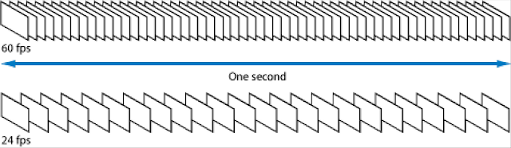
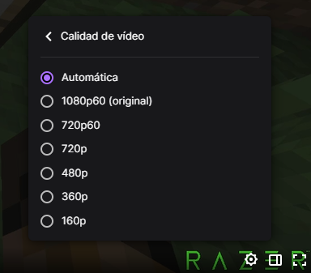

# 03. FPS

## Frames

Los vídeos no son más que secuencias de fotos, una después de la otra, que al reproducirse dan sensación de movimiento. Antiguamente estas fotos (fotogramas) se grababan en rollos de cinta.

Cada fotograma (frame) se divide en líneas horizontales y líneas verticales. Cada puntito donde se junta una línea vertical y una horizontal se llama **píxel** y, por tanto, un conjunto de píxeles conforman un fotograma o frame.

Los frames por segundo indican la cantidad de fotos o fotogramas (frames) que se han grabado en cada segundo de ese vídeo

## ¿Cuáles son los valores de FPS más habituales?

Los valores de FPS más habituales varían dependiendo del medio en el que se utilizan. Los contenidos de **televisión** se procesan a 25 fps, los dibujos animados a 15 fps, el **cine** a 24 fps, los **videojuegos** a 60 fps y los televisores de alta definición modernos ofrecen una tasa de refresco de hasta 120 fps. Estos valores están establecidos como estándares en el mundo de la producción de contenido.

Hoy en día se llegan a grabar vídeos de 30, 60 o 120 FPS, un valor más elevado. El vídeo parece más fluido y la experiencia de juego es mejor con valores altos, pero por contra:

## ¿Qué inconvenientes tiene grabar a una alta tasa de FPS?

Una mayor tasa de cuadros por segundo significa que necesitarás **procesadores más potentes y tarjetas de vídeo** para editar y reproducir correctamente el contenido. Esto puede hacer que sea más costoso y menos práctico para algunos usuarios.

Grabar a una tasa de FPS más alta también significa que necesitarás una tarjeta de captura más potente, lo que aumentará los costos.

Por último, pero no menos importante, el proceso de codificación de un archivo de vídeo a una tasa de FPS más alta es **más lento**. Esto significa que los usuarios tendrán que esperar más para ver el contenido deseado.

Videos: https://www.youtube.com/watch?v=2Ds7EcJ2Ia4

## ¿Qué valores podemos usar en Internet?

Cuando vemos un vídeo en``YouTube``, la calidad se ajusta automáticamente a la conexión de Internet que tengamos y a la resolución de nuestra pantalla.

De todos modos, podemos seleccionarla manualmente, bien para mejorar la calidad y verlo mejor, como para reducir los datos que consume el vídeo.

YouTube por el momento no permite tasas de más de 60 FPS.

