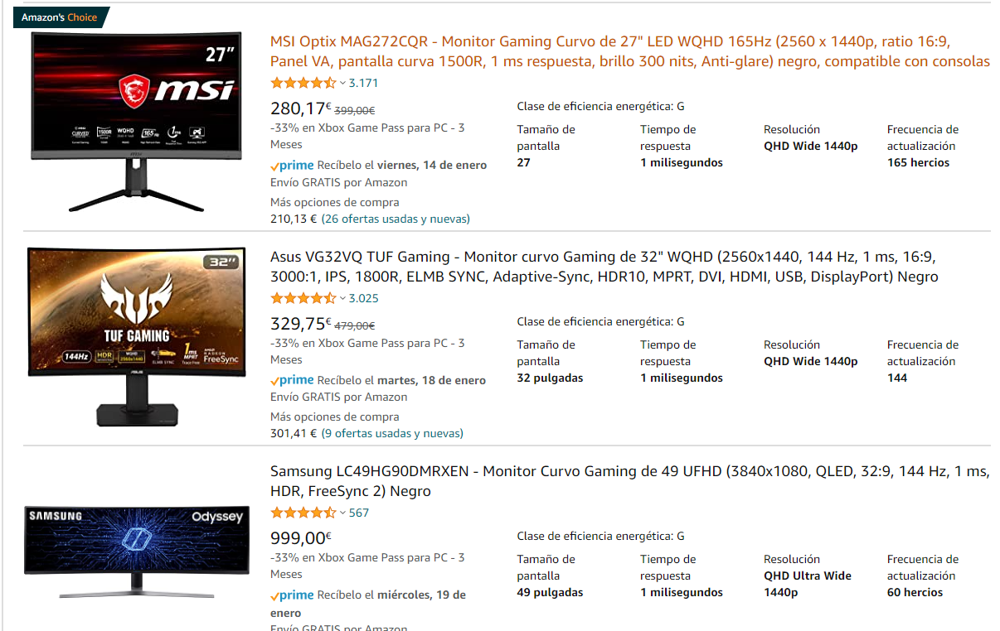

# Frecuencia de refresco

Las pantallas están programadas para cambiar lo que se muestra en pantalla a una frecuencia determinada. Es decir, para 60 Hz la pantalla modifica lo que muestra 60 veces por segundo.

Esto tiene una importancia enorme, puesto que no se pueden mostrar más FPS que la frecuencia de refresco de la pantalla. Si está a 60 Hz, no podrá por ejemplo mostrar 120 FPS, solo 60. Por lo que no notaremos diferencia en calidad.

