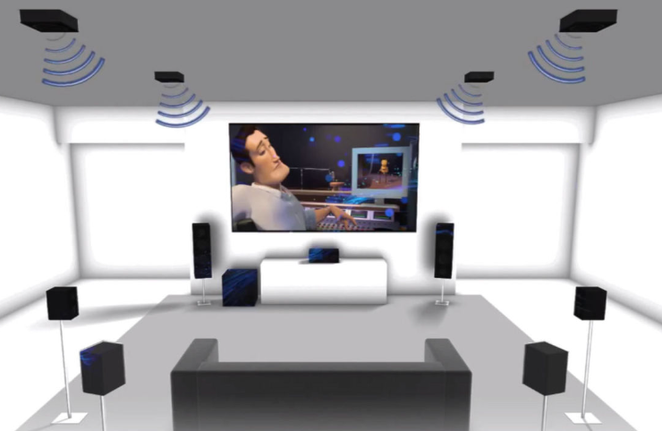

[🔙 Enrere](../) | [🏠 Pàgina principal](http://danimrprofe.github.io/apuntes/)

# 07. Alta definición

Hoy en día la mayoría de equipos que pueden procesar y reproducir video en alta definición. Alta definición se aplica al contenido que tiene más de 720 píxeles de alto. Se etiquetan con:

- **HD** para una calidad de 720p
- **Full HD** para una calidad de 1080p
- **4K** para una calidad equivalente a 4 pantallas FullHD juntas (2160p).

Los equipos que compramos traen etiquetas en las cajas que nos indican de la calidad de vídeo que permiten visualizar o grabar.

## 4K y superiores

Existen calidades de vídeo por encima del FullHD, como **4K** o incluso **8K**. Como se puede apreciar, en el mismo tamaño de televisión caben más píxeles, y por tanto la definición y la calidad de la imagen es mayor.

## Equipamiento

Para poder ver películas o series en 4K o superior, necesitamos:

- Tener un **monitor** compatible con esta tecnología. Si nuestra televisión es fullHD no podremos ver nada grabado a 4k.
- Que la **película** o la serie que veamos esté grabada a 4K. Si no lo está, se verá con menor calidad de la esperada, por mucho que la televisión sea 4K.
- La **conexión a Internet** tiene que ser suficientemente rápida para permitir recibir el contenido en 4K. Si tenemos contratado, por ejemplo, Netflix a 4K, pero nuestra conexión de internet es muy lenta, solo lo veremos en FullHD o menor.

## Blu-ray Ultra HD

Como los discos Blu-ray no tienen capacidad suficiente para guardar una película en formato 4K (es mucho más grande), se inventó el formato **Blu-ray Ultra HD**. Las películas grabadas en un Blu-ray convencional, solo pueden almacenar video en FullHD (1080).

Además, los discos Blu-ray Ultra HD también pueden almacenar contenido de audio en alta definición, como el formato **Dolby Atmos**, y contenido extra, como comentarios de director, escenas eliminadas y más. Esto hace que los discos Blu-ray Ultra HD sean ideales para aquellos que quieren disfrutar de la calidad de imagen y sonido de la mejor manera posible.

En el caso de Blu-ray, necesitamos tener todos los componentes necesarios para poder ver contenido a la calidad deseada:

