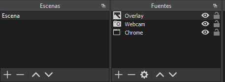

# OBS

## Composición de escenas y streaming con OBS

OBS es un programa gratuito y libre que nos permite capturar diferentes fuentes de video en tiempo real y componer diferentes escenas, así como codificar video, grabar y retransmitir.

Este streaming se puede emitir a través de una plataforma como Twitch, YouTube o Facebook, por ejemplo.

Se puede descargar aquí: Download OBS Studio

Actualmente, también existe una versión de OBS llamada streamlabs, que integra OBS con plataformas de streaming y nos ofrecen contenido para crear nuestras escenas a partir de plantillas, entre otras opciones.

## Escenas

OBS funciona a través de una estructura de escenas. Se pueden crear varias, pero solo una escena se transmitirá a la vez.

Las escenas definen los diferentes escenarios que vamos a crear para utilizar en nuestro video. Una vez definidas, podemos cambiar de escena en cualquier momento sin tener que cambiar nada.

Aquí debajo puedes ver una escena compuesta de dos fuentes, una página web y una webcam.

## Fuentes

Las fuentes son los orígenes de nuestra grabación. Pueden ser cámaras, ventanas, imágenes, juegos, etc. Cada fuente la podemos colocar en diferentes partes de la pantalla para configurar nuestra escena.

En este caso, únicamente tenemos una escena, con 3 fuentes diferentes. Se superponen unas a otras, por lo que es importante el orden en que se colocan.

## Overlays

Podéis utilizar diferentes overlays para las transmisiones. Los overlays son imágenes prediseñadas con zonas transparentes, que podemos colocar encima de la escena, y utilizarla de marco de fotos.

Podéis descargar uno de ejemplo aquí: Imagen overlay png

