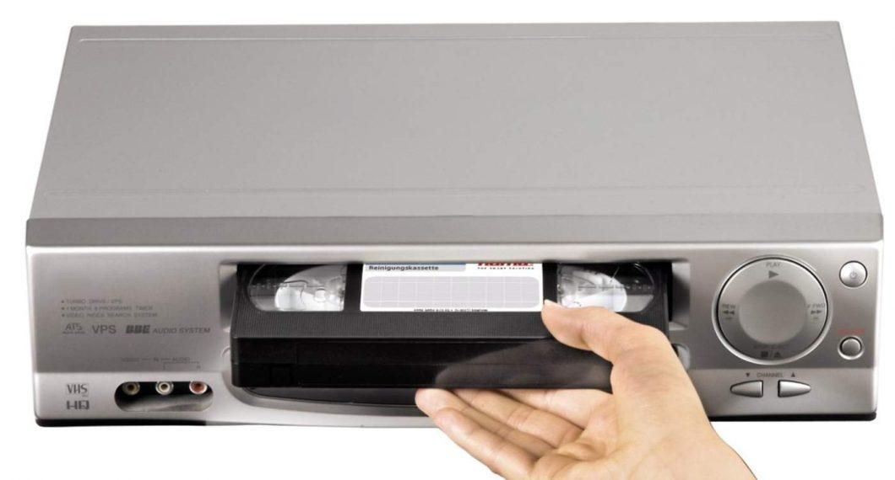

# 11. Evolución hacia el streaming

## Televisión en España

La evolución de la televisión en España ha sido básicamente la siguiente:

Dos canales públicos en abierto. Nacimiento de Televisión Española (TVE) no tuvo lugar hasta el año 1956. Fue en 1965 cuando apareció la Segunda Cadena (TVE2)

Otros canales autonómicos a partir de 1982.

Entran más cadenas privadas sobre 1990 (Telecinco, Antena 3, etc.)

Comienza canal+, primer canal codificado de pago.

Se comienza a emitir TV por satélite. Vía digital y Canal Satélite Digital. Se necesita de receptores específicos e instalación de una antena de satélite.

## Emisión de canales a través de la conexión a Internet

En ordenadores no se veía prácticamente televisión, a no ser que se utilizase una tarjeta de expansión de TV.

## Vídeo VHS

El consumo de vídeo en forma de películas se realizó a través de reproductores de VHS y cintas de vídeo que se podían alquilar en un videoclub y/o comprarlas. También se podía grabar la señal de televisión en cintas grabables.

Mucho más tarde aparecieron las primeras películas y juegos en DVD y, posteriormente, en Blu-Ray.
