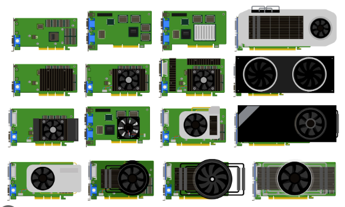
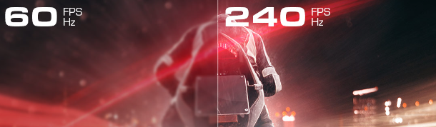

[🔙 Enrere](../) | [🏠 Pàgina principal](http://danimrprofe.github.io/apuntes/)

# 12. Videojuegos

En videojuegos, lo que se nos muestra en pantalla son imágenes generadas por la tarjeta gráfica, en función de lo que está sucediendo en el juego.

Por lo tanto, la calidad de estas imágenes (resolución) y la tasa de fotogramas por segundo (fps) vienen determinadas por la potencia del ordenador o consola.

## Consolas

En el caso de consolas, al tener toda la misma tarjeta gráfica, los juegos ya se crean para que la resolución y la tasa de frames se mantengan estables en ese modelo de consola, cosa que no se puede hacer en PC.

## Tarjeta gráfica o GPU

Cuanta más resolución y más FPS, más trabajo tiene que hacer la tarjeta gráfica, por lo que, si esta es mejor, nos permitirá ver los juegos con una mayor calidad y tasa de frames o framerate.

Una tarjeta gráfica más potente puede manejar gráficos de **mayor resolución y tasas de fps más altas**, lo que se traduce en una mejor calidad visual y una experiencia de juego más **fluida** y sin interrupciones.

Por otro lado, una tarjeta gráfica más débil podría no ser capaz de manejar gráficos de alta calidad, lo que resulta en imágenes pixeladas o una tasa de fps baja y una experiencia de juego lenta y entrecortada. Si la tarjeta no da abasto, cada vez generará menos FPS y la experiencia de juego disminuirá hasta hacerse **injugable**.

## Monitor

Además, la tasa de refresco del monitor también es un factor importante. Si tienes una tarjeta gráfica capaz de generar una alta tasa de fotogramas, pero tu monitor solo tiene una tasa de refresco de 60 Hz, solo podrás ver hasta 60 FPS. Si quieres disfrutar realmente de una alta tasa de fotogramas, necesitas un monitor con una tasa de refresco alta, como 120 Hz o 144 Hz.

## Ordenadores

una de las ventajas más significativas de tener un PC para jugar es la posibilidad de tener un mayor control sobre la configuración gráfica y, por lo tanto, sobre la tasa de fotogramas por segundo (FPS). Con un hardware superior, se pueden lograr tasas de FPS más altas, lo que se traduce en una experiencia de juego más fluida y sin interrupciones.

En un PC, es el usuario quien debe elegir cuidadosamente la configuración gráfica adecuada para su sistema y juego específico. Si se tienen conocimientos técnicos, se puede ajustar manualmente cada parámetro para maximizar la calidad visual y la tasa de FPS. Por otro lado, también existen perfiles de calidad preconfigurados que ajustan automáticamente varios parámetros para optimizar la experiencia de juego.

Sin embargo, es importante tener en cuenta que a medida que se aumenta la resolución y los detalles en el juego, la tasa de FPS puede disminuir, incluso con hardware potente. Por lo tanto, se debe encontrar un equilibrio entre la calidad visual y la tasa de FPS para obtener la mejor experiencia de juego posible.

