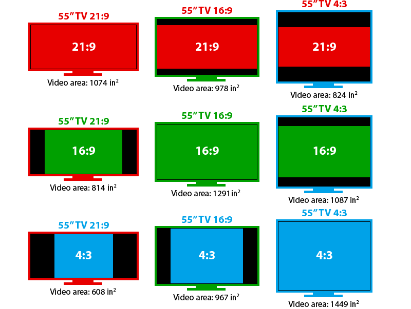
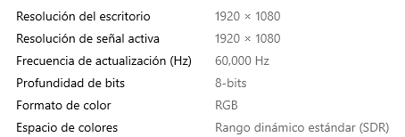
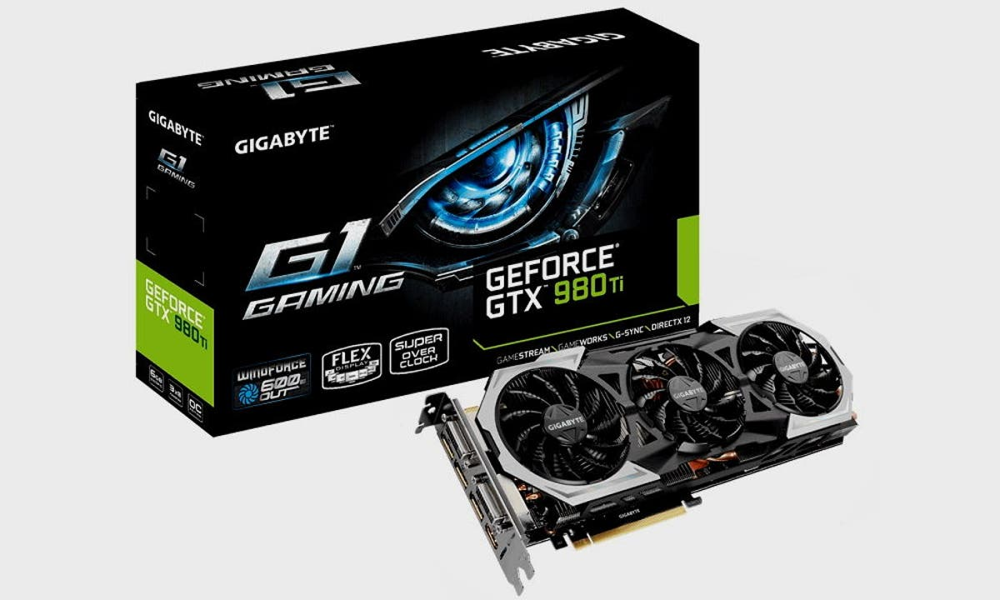

# 12. Video digital

## Píxeles

Las imágenes digitales se guardan en forma de píxeles. Cada píxel tiene un color y una posición en la imagen, que se guarda en forma de 1s y 0s en el ordenador.

La información de todos los píxeles que contiene una imagen se guarda en un archivo.

## Resolución

<https://www.youtube.com/watch?v=5flF7bgWgr4>

La cantidad de píxeles que tiene una imagen determina su resolución.

A mayor resolución, mayor tamaño tiene la imagen y, en general, definición. Es decir, más detalles se aprecian en la imagen, por lo cual suele tener mejor calidad.

Las imágenes anteriores son de 10x10 o 15x15 píxeles, porque se expresa en ancho por alto. Cuando la resolución es muy alta, se dice que la imagen es de alta definición (HD).

También podemos medir la resolución en megapíxeles. Para ello, tenemos que multiplicar el ancho y el alto en píxeles de la imagen.

Resoluciones más importantes

Las resoluciones más importantes están estandarizadas. Esto permite que en todo el mundo todos entendamos lo mismo.

El factor más importante es el tamaño vertical.

Cuando a lo alto la imagen tiene 1080 píxeles se dice que es de calidad FullHD.

En el caso de 1440 se trata de calidad 2K

Cuando es de 2160 (el doble), se dice que es UltraHD o 4K.

Existen resoluciones más bajas como 720 (HD) o 480, por ejemplo.

Los monitores, pantallas o proyectores también tienen una resolución máxima. Es decir, que solo pueden mostrar imágenes de una resolución concreta o inferior (de menor calidad).

Si por ejemplo nuestro monitor es FullHD (1080),no podrá mostrar contenido 4K (2160) porque la pantalla no tiene píxeles suficientes para ello. En ajustes podemos ver las resoluciones que admite nuestro monitor.

En cambio, en este televisor podremos ver contenido hasta 4K de resolución. Pensad que la calidad de lo que veamos en ella dependerá de la fuente.

Es decir, si pongo un canal de TV, pongo un Blu-ray normal o juego en una PS4, no encontraremos contenido de mayor resolución que FULL HD.

En cambio, si tenemos Netflix con capacidad de 4K, películas Ultra HD Blu-ray o una PS5, estos sí nos darán resolución de 4K.

## Relación de aspecto

No todas las pantallas tienen la misma forma. Es decir, las proporciones son diferentes en una pantalla de cine, que en una tele o un smartphone. A esto se le llama aspect ratio o relación de aspecto.  Este se mide en unidades de largo por unidades de ancho, separados por dos puntos.

En la televisión tradicional esta ha sido siempre de 4:3, pues esta era la forma de las televisiones.

Actualmente, debido a la alta definición se utiliza más el formato panorámico, más alargado y similar a la vista humana. El formato llamado panorámico es el de 16:9 o dieciséis novenos.

<https://www.youtube.com/watch?v=z_VtxrKolZU>

Frecuencia de refresco

Las pantallas están programadas para cambiar lo que se muestra en pantalla a una frecuencia determinada. Es decir, para 60 Hz la pantalla modifica lo que muestra 60 veces por segundo.

Esto tiene una importancia enorme, puesto que no se pueden mostrar más FPS que la frecuencia de refresco de la pantalla. Si está a 60 Hz, no podrá por ejemplo mostrar 120 FPS, solo 60. Por lo que no notaremos diferencia en calidad.

## Dispositivos de grabación

Podemos grabar vídeos a través de múltiples dispositivos diferentes. Si asistimos a clases online o teletrabajamos con un ordenador, lo más práctico es una webcam. En el caso de portátiles, ya suele venir incorporada.

Si queremos streamear, nos conviene una webcam de mayor calidad.

También existen drones que nos permiten acoplar a ellos una cámara o directamente la incorporan, para tomar imágenes aéreas.

Lo más habitual es grabar nuestros vídeos o reuniones a través del smartphone, por lo que nos conviene saber de qué es capaz. Las cámaras son uno de los factores más importantes a la hora de elegir uno u otro modelo, y son la principal diferencia entre gamas de móviles.

Los móviles más antiguos incorporaban una cámara trasera para fotografía y una frontal de menor calidad para videollamadas, selfies o faceID.

## Tipos de cámara

Actualmente es habitual encontrar que incorporan entre 3 y 4 módulos, que habitualmente son:

- Gran angular
- Super gran angular
- Teleobjetivo

## Diferencia entre angular y gran angular

El gran angular nos abrirá el campo de visión para que, de cerca, nos quepan más elementos en pantalla.

## Modos de vídeo

Según el tipo de cámaras que incorpora nuestro smartphone, tendremos diferentes modos de vídeo que podemos elegir desde la propia app de la cámara.

Por poner un ejemplo, los modelos de iPhone 13 Pro admiten grabación de

- Vídeo de hasta 4K a 24, 25, 30 y 60 FPS
- Video HDR con Dolby Vision a 4K de hasta 60 cuadros por segundo.
- Video de 1080p y 720p también están disponibles.

Desde dentro de la propia App de la cámara o en ajustes, podremos elegir la calidad de vídeo que queremos utilizar, en función de la situación y la finalidad del vídeo.

## Zoom

En fotografía, el zoom de la cámara se refiere a hacer que un sujeto aparezca más cerca o más lejos en una imagen. Hay diferentes tipos de zoom que utilizan diferentes teléfonos inteligentes:

**Zoom óptico**: se logra mediante el uso de una serie de elementos de lente. Las lentes de los teléfonos inteligentes no pueden moverse al zoom óptico, por lo que el teléfono cambia sin problemas a la cámara con el factor de aumento más alto.

**Zoom digital**: el zoom digital logra un efecto similar al zoom óptico, pero recorta áreas alrededor de la escena para que parezca que estás más cerca del sujeto.

## Pantalla

Las pantallas determinan la calidad máxima que podemos visualizar en ella.

## Tamaño

Por un lado, está el tamaño, que se mide en pulgadas. Cada pulgada son 2.54 cm, y se mide en diagonal. De esta forma sabemos si una pantalla es más o menos grande, que no si tiene más o menos calidad.

## Resolución

También es importante la resolución, que nos indica cuál es la calidad máxima que podemos ver en esa pantalla. Si la resolución es de 1080, podremos ver contenido en calidades FullHD o inferiores, pero no superiores, como 2K o 4K.

## Puntos por pulgada (ppp o ppi)

Como dos pantallas pueden ser FullHD (1080, por ejemplo), pero tener tamaños diferentes, la calidad de lo que vemos no es la misma. En una pantalla más pequeña la misma resolución se verá mejor. Por ello también se cuentan los puntos por pulgada o ppp (ppi en inglés). Este parámetro cuenta en una superficie de 1 por 1 pulgada, cuántos píxeles hay dentro.

## Frecuencia de refresco

Indica con qué frecuencia se cambia el contenido de la pantalla, y se mide en Hz. Esto limitará los FPS que podemos visualizar.

## Estabilización

Un problema habitual en vídeo que no encontramos en fotografía es el de la estabilización. Conforme nos movemos, hay vibraciones, etc. El vídeo refleja esos movimientos y la calidad se resiente.

Antiguamente se empleaban estabilizadores, aunque hoy en día los móviles suelen tener programas internos que, utilizando el sensor de giro, corrigen la imagen para que se vea estable.

A modo profesional, se utilizan unos soportes llamados gimbal, que incorporan un mecanismo que hace que la cámara siempre esté en la misma posición, aunque nos movamos nosotros.

## Videojuegos

En videojuegos, lo que se nos muestra en pantalla son imágenes generadas por la tarjeta gráfica, en función de lo que está sucediendo en el juego.

Por lo tanto, la calidad de estas imágenes (resolución) y la tasa de fotogramas por segundo (fps) vienen determinadas por la potencia del ordenador o consola.

Cuanta más resolución y más FPS, más trabajo tiene que hacer la tarjeta gráfica, por lo que, si esta es mejor, nos permitirá ver los juegos con una mayor calidad y tasa de frames o framerate.

Si la tarjeta no da abasto, cada vez generará menos FPS y la experiencia de juego disminuirá hasta hacerse injugable.

Cuanto mayor sea el FPS, más fotos verás en la misma cantidad de tiempo.

Jugar con un FPS alto te dará más información y detalles para conocer tu entorno.

## Consolas

En el caso de consolas, al tener toda la misma tarjeta gráfica, los juegos ya se crean para que la resolución y la tasa de frames se mantengan estables en ese modelo de consola, cosa que no se puede hacer en PC.

## Ordenadores

El beneficio más significativo de tener un PC, es que los jugadores tienen más control sobre la configuración gráfica, lo que afecta los FPS. Con un hardware significativamente superior, puede alcanzar tasas de FPS más altas.

En un PC, somos nosotros quienes tenemos que elegir el modo de juego que va a funcionar en nuestro PC.

Si tenemos conocimientos, podemos variar los parámetros manualmente uno a uno para ajustarlos

También existen perfiles de calidad, de tal forma que eligiendo uno u otro se ajustan varios parámetros automáticamente.

A mayor resolución y detalles en el juego, más baja la tasa de frames.

