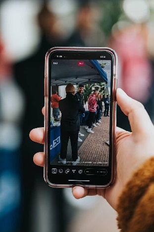
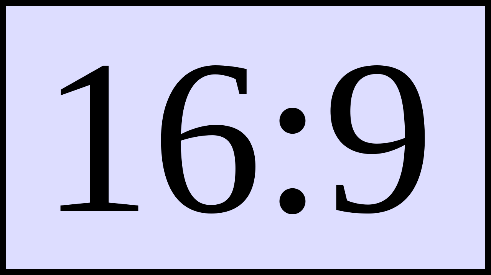
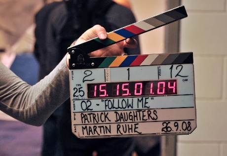

# 3. Grabación

Una vez decidido el plan, toca grabar las secuencias que necesitaremos para crear nuestro vídeo.

Desde dónde grabar

Nuestros videos los podemos grabar de diferentes formas:

Desde un smartphone

Desde una webcam

Desde una cámara de fotos convencional

Capturar la pantalla de nuestro ordenador, consola o nuestro smartphone.

También podemos utilizar clips de vídeo ya existentes en internet, o vídeos que tengamos grabados previamente.

Calidades

Si grabamos desde el móvil, podemos elegir diferentes calidades de vídeo. Los archivos se suelen guardar en formato mp4.Según la calidad elegida, el espacio que ocupa el vídeo variará. Por ejemplo, mi móvil tiene las opciones:

1080 (si no se dice nada suele ser 30 fps)

1080 60 fps

4K (30 fps)

4k 60 fps

Intentad que todos los vídeos estén grabados con la misma calidad. Una resolución de 1080 sería lo más adecuado.

Elegid una relación de aspecto igual en todas las tomas, la más recomendable es 16:9, para visualizarlo correctamente en cualquier dispositivo.

Grabando tomas

Al grabar video para nuestro proyecto, realizaremos diferentes tomas. Cada una en un lugar concreto y con una finalidad concreta. Vale la pena tomar muchas tomas de sobra, para poder elegir a posteriori. Si luego necesitamos alguna, nos será más complicado volver a grabarla

Intenta combinar diferentes planos: panorámicos, primeros planos, detalle etc. Como vimos en el tema de fotografía. También varía la posición de la cama (picado, contrapicado, etc.)

Aquí puedes ver una explicación de los diferentes planos y encuadres, que te ayudarán: 

📷 Taller fotografía

Guardado

Una vez lo tengamos todo grabado, guarda todos los vídeos en un ordenador o en la nube, y haz copias para tenerlo guardado por si hubiera algún problema.

⚠️ Tened en cuenta que, si compartís fotografías o vídeos a través de WhatsApp o RRSS, estos archivos perderán calidad, por lo que no es lo recomendable.

También puedes conectar el móvil al PC con un cable para buscar los vídeos y extraerlos por USB.

Puedes subir los vídeos directamente a YouTube o alguna red social sin necesidad de editarlo.

Puedes subirlo a Dropbox o Google drive, para poder descargarlos desde el ordenador.

Si vas a editar en PC, necesitarás pasar estos archivos desde el smartphone en primer lugar.

Organización

Organiza los videos en carpetas, con diferentes nombres, como harías con otros documentos. De esta forma, será más fácil encontrarlos luego cuando hagas la edición. 

Clips en internet

Para crear nuestro video utilizaremos clips o pequeños fragmentos de vídeo y audio, que habremos grabado nosotros o descargados de internet.

La fase de edición se llama postproducción o montaje, y en ella colocaremos todos nuestros clips en diferentes pistas (tracks), los moveremos, recortaremos y aplicaremos efectos.

Podemos descargar vídeos de stock, que otros han creado para que los podamos incluir en nuestros propios proyectos.

En esta página podéis encontrar muchos: Pexels Videos

Para sonido: Mixkit

Para imágenes: pixabay.com