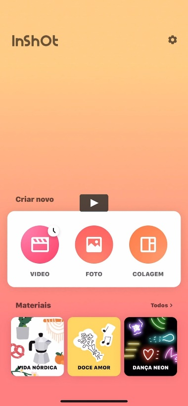
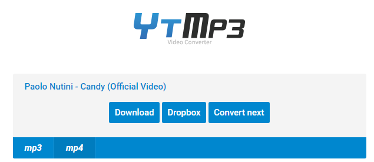

# 4. Edición

## PROGRAMAS DE EDICIÓN DE VÍDEO

Una vez grabados, los podemos compartir, guardar o publicar tal cual los hemos capturado, o editarlos para crear un vídeo nuevo a partir de otros, añadiendo efectos o música, por ejemplo.

Existen varios programas para hacer la edición, de más sencillos a más complejos.

En Android

Si queremos editar desde el móvil, las apps suelen ser más sencillas y un poco más limitadas, por la propia potencia del smartphone y el tener que editar en una pantalla tan pequeña. Algunos programas útiles son:

* Adobe Rush
* InShot
* Kinemaster
* VLLO
* Filmora play store
* CapCut
* Youcut

En PC

Para editar nuestros vídeos en ordenador utilizaremos Openshot, un programa de edición de vídeo gratuito y de código abierto. También existen otros como:

* MiniTool movie maker
* Camtasia (orientado a tutoriales)
* Adobe premiere
* Sony vegas
* Davinci resolve

En caso de tener productos de Apple, también tenemos:

* iMovie (App store)
* Final cut Pro
* Splice

## Openshot

Existen varias versiones de Openshot:

* Versión para instalar (si tenéis permisos de administrador): Openshot
* Versión portable: Si no tenéis permisos, podéis descargar la versión portable, e instalarla en una carpeta de vuestro ordenador. Podemos descargarla aquí: Versión portable de Openshot

## Extraer el audio de un video

Para descargar un vídeo de YouTube o su música: <https://ytmp3.cc/en13/>

Enlaces

Os pongo algunos vídeos útiles para comenzar a utilizar Openshot y familiarizarse con él, que espero os puedan ayudar:

Openshot - editor de videos gratuito - tutorial en español
