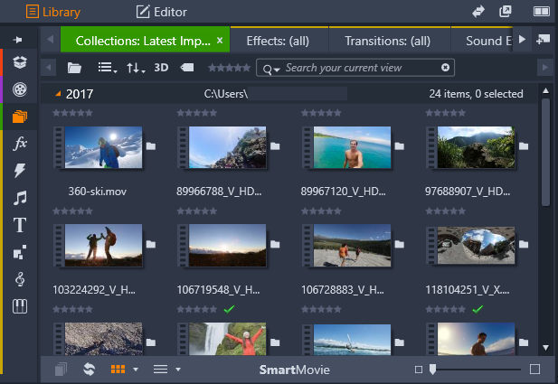
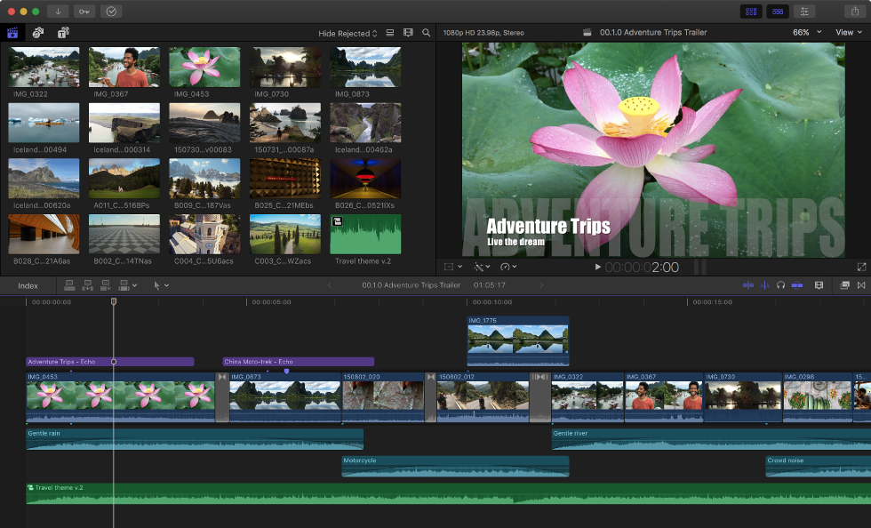
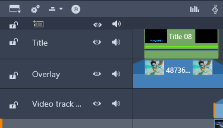
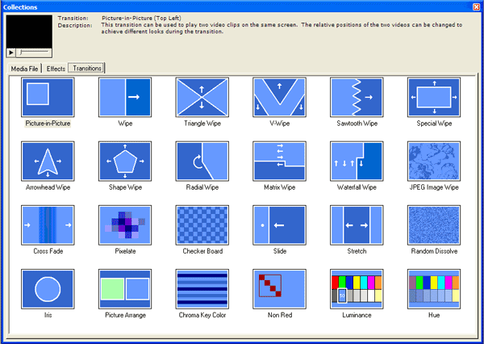
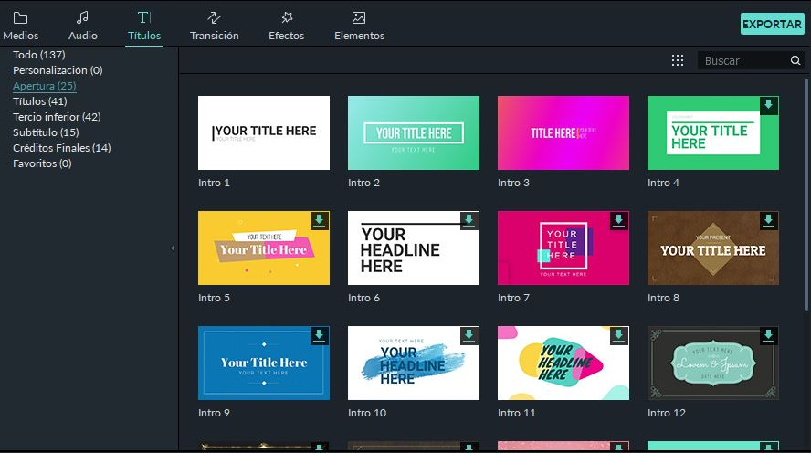
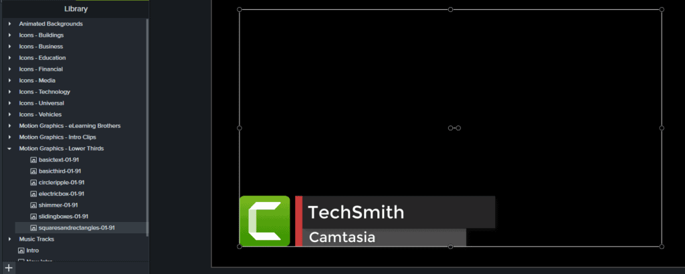

# 5. Fases de edición

## Previsualización

Mira todas tus filmaciones, para ir familiarizándote con ellas. De esta forma, te irás haciendo una idea de cuales vas a utilizar y cómo las combinarías.

## Montaje

Generalmente, para el montaje, partiremos de varios clips de vídeo que habremos tomado por separado, así como archivos de audio de música, efectos sonoros o grabaciones de voz.

## Biblioteca

La biblioteca es una herramienta para gestionar y catalogar todos los recursos de archivos a los que puede recurrir al crear su contenido. 

Tiene como finalidad permitirle elegir y utilizar de la forma más fácil, rápida e intuitiva posible los segmentos de vídeo, fotos, fragmentos de sonido, efectos de transición, títulos y otros “recursos” (como se les suele llamar comúnmente) para sus películas

## Pistas

Crearemos diferentes pistas donde colocaremos clips de vídeo, los recortaremos, los colocaremos en el momento que queramos y les añadiremos efectos.

La línea de tiempo es el lugar donde se crea la película añadiendo vídeo, fotografías y audio desde la Biblioteca, editando y recortando estos medios y dotándolos de animación con transiciones, efectos y otras mejoras.

## Cabeceras de pista

La línea de tiempo se compone de varias pistas (tantas como se necesite) colocadas verticalmente. Las pistas superiores se presentan hacia el frente, sombreando con sus partes opacas las pistas inferiores.

Coge las mejores tomas, y colócalas en la misma pista (track) en la timeline de forma secuencial, una detrás de la otra. Así las tendrás colocadas en orden, de manera cronológica.

## Recortar las tomas

Recorta el principio y final de las tomas hasta donde sea necesario, para dar forma a la historia. Recuerda borrar todas las muletillas como “aaah”, “eeeh”, “mmm”, etc.

## Une las tomas con transiciones

Agrega transiciones donde sea necesario, para hacer más variado el vídeo y añadir algo de ritmo. Te darán una sensación de que pasa el tiempo. También puedes utilizar cortinillas.

Revisa el vídeo varias veces, para ver si tienes que añadir más detalles, hacerlo más lento, etc.

## Perfecciona el montaje.

Agrega tarjetas de título o texto. Los títulos los puedes colocar al principio o al final del vídeo, para ayudar a la audiencia a saber lo que vas a decir. 

Usa tarjetas de texto si es necesario para llamar la atención o agregar alguna información. 

⚠️ Es importante que estén en pistas separadas, para colocarlas en el lugar que queramos y se superpongan al video.

