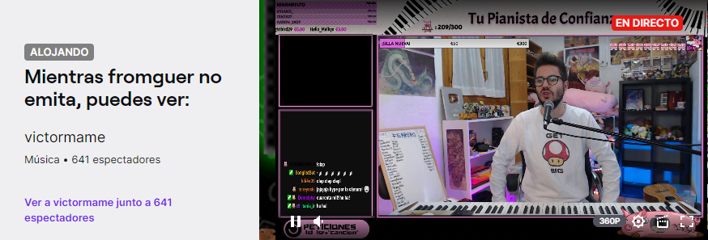
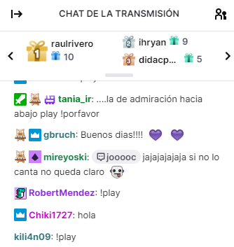

# 8. Twitch

Aunque no es obligatorio, otra herramienta muy útil sobre todo para directos es Twitch. Es algo más complejo de crear y editar, pero muy interesante.

Podéis verlo en twitch.tv o instalar la app de Twitch desde la Play Store.

Twitch nace como un servicio de vídeo online para retransmitir en directo partidas de videojuegos, desde personales a grandes torneos.

Hoy en día, se ha expandido para incluir también otras disciplinas como música, arte o, simplemente charlas de diversas temáticas a modo de podcast, entre otros. Estas son las categorías. En general, cada juego tiene una categoría propia.

La mayoría de la comunidad de Twitch únicamente visualiza vídeos, y comenta a través de un canal de chat, entre otras opciones.

Actividad 1: Regístrate en Twitch (si no lo has hecho ya) y haz una captura en la que se vea tu nombre de usuario.

## Los canales

Twitch se organiza por canales. Cada streamer o persona que emite contenidos, crea su propio canal y, si quiere, configurar ciertos aspectos como los horarios de emisión, iconos o comandos de chat personalizados, y ciertas recompensas.

Los canales están organizados por categorías, e incluyen ciertas etiquetas (español, composición musical) para describir qué tipo de contenido realizan y en qué idiomas retransmiten.

Actividad 2: busca canales de la categoría que tú quieras, y adjunta una captura de pantalla.

Las retransmisiones se pueden ver en directo o bien en diferido. Debajo del vídeo, podremos ver información sobre el canal, como funciona su comunidad, qué contenido puedes encontrar, así como cuantos usuarios están viendo el directo, si sigues o no el canal y un botón para suscripciones.

Actividad 3: Elige un canal, adjunta una captura como la de arriba y explica cuál es la categoría y las etiquetas de ese canal. 

## Hostear

Cuando el streamer no está online, puede hostear un canal. Es decir, en su canal se verá el de otro streamer que él haya elegido para que sus seguidores lo puedan ver mientras él no está retransmitiendo.

Actividad 4: Busca un canal que esté hosteando a otro y adjunta una captura de pantalla

## Raids

Cuando un streamer va a dejar de emitir, antes de cerrar la retransmisión puede ceder sus seguidores a otro canal que esté emitiendo en este momento. Esto se llama hacer una raid. Los seguidores que quieran pueden cambiarse a este nuevo canal y seguir viéndolo si les apetece.

Seguir un canal

Seguir un canal es gratuito, y es similar a seguir a un usuario en Instagram o Twitter. Puedes seguir a todos los usuarios que te interesen. Cuando el usuario comienza un stream o retransmisión, se te notificará que comienzan, para que puedas abrir su canal y ver su emisión en directo.

De este modo podremos ver si alguno de nuestros canales está emitiendo, y se nos recomendarán otros parecidos a los que ya seguimos.

Actividad 5: Busca 5 canales que sean de tu interés y síguelos. Si ya tenías Twitch, busca canales nuevos. Adjunta una captura de pantalla como la de arriba.

Participar activamente en la retransmisión

Cada canal tiene asociado un chat, en el que los usuarios que ven el stream pueden compartir sus impresiones con los otros espectadores o viewers, o interactuar con el streamer, para pedirle algo o darle algún consejo.

Otros métodos de participación incluyen votaciones, que pueden ser iniciadas para que los usuarios den su opinión sobre ciertos temas.

Al tratarse de un chat, existen moderadores que ayudan al streamer, bloqueando usuarios o ayudándole a gestionar el chat. 

Los chats también disponen de ciertos comandos que el bot del canal reconoce automáticamente para realizar ciertas acciones.

Actividad 6. Participa en un chat (aunque sea una frase) y utiliza un comando en ese chat. Se tiene que ver en una captura de pantalla (como la de arriba). Explica para qué sirve el comando.

## Suscripción a un canal

Si quieres participar de una forma más activa en el canal te puedes suscribir. En principio las suscripciones son de pago mensual, pero si tienes Amazon prime te puedes suscribir gratuitamente a un canal por mes.

Existen diferentes modalidades de suscripción según el tiempo que lleves viendo el canal y el nivel de suscripción, que te dan ciertas ventajas y, a cambio, ayudan económicamente al streamer

Actividad 7. Elige un canal y explica con todo el detalle que puedas qué tipo de suscripción tiene y que ventajas da cada tipo de suscripción. Agrega una captura de pantalla.

## Crear un canal y emitir (opcional)

Si tienes conocimientos suficientes, ganas y algo que quieras compartir, puedes crear un canal propio y emitir tu propio contenido. Para esto necesitarás un mínimo de equipamiento y configuración.

