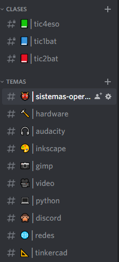
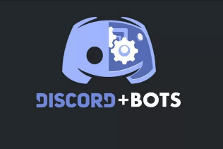

# 9. Discord

9. Discord

Introducción

El funcionamiento de Twitch va muy ligado a Discord, una herramienta de chat y voz para comunidades virtual. 

Sirve de herramienta de comunicación entre los seguidores de un determinado canal, fundamentalmente cuando este no está emitiendo. De este modo comparten dudas, archivos, y hablan entre ellos.

¿Qué es Discord?

Discord es una plataforma gratuita de chat de texto y voz para comunidades, disponible en todos los sistemas operativos.

Puede ser usado desde:

Navegador: Discord navegador

Smartphone: Discord play store

Aplicación de Windows: Discord para Windows

Otras opciones de videoconferencia requerían compartir direcciones IP para conectarse, o se trataban de servicios pesados como Skype o Teamspeak.

Servidores

Cada comunidad de personas puede crear su propio servidor de Discord, al que nos podemos conectar si nos invitan previamente. De este modo, podemos conectarnos a tantos servidores como queramos, y cambiar de uno a otro.

Podemos buscar servidores públicos en algunas páginas como Discord Servers

Crear un servidor

Discord se organiza por servidores. Cada comunidad de usuarios alrededor de un tema concreto se conecta a un servidor (que alguien ha creado y administra) para comunicarse. 

El proceso de creación es sencillo, y existen plantillas predefinidas, por lo que parte de nuestro servidor vendrá creado por defecto.

## Canales

Cada servidor tiene varios canales de texto y voz, donde los usuarios pueden interactuar entre ellos. Cada canal trata de un tema concreto.

Los usuarios van al canal de la temática que más les interesa o la que tiene relación con su duda o consulta.

Los nombres de los canales comienzan con # como:

#musica 

#juegos

Canales de voz

Funcionan como una videollamada continua a la que se pueden unir en cualquier momento. De este modo, también podría compartir la pantalla y dar clase a distancia, así como comunicarme con ellos por voz.

Roles

Los roles funcionan como en la vida real. En principio todas las personas somos «iguales ante la ley», pero cada una tiene un rol en una empresa, instituto o en la sociedad. 

Todos los usuarios que tienen asignados el mismo rol, tienen unos permisos y pueden hacer más cosas que las personas que no lo tienen.

Bots

Podemos crear usuarios Bot, que responderán automáticamente a ciertos comandos que escribamos en el chat.

Buscar bots de Discord: https://top.gg/

Uno de los bots más conocidos es este: https://mee6.xyz/

Los bots responden a ciertos comandos, que nos permiten interactuar con ellos. ¡Suelen comenzar por un carácter especial, como por ejemplo un signo de exclamación !

