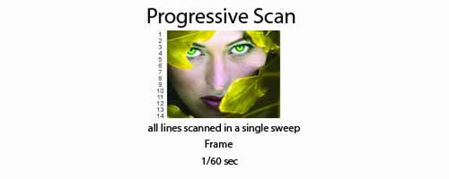

# Edición de vídeo

# Introducción

Nuestros ojos ven en todo momento las imágenes que le llegan a través de la luz. Como es imposible grabarlo todo, para grabar vídeo se toman fotos llamadas **fotogramas** cada cierto tiempo y se juntan todas.

La retina de nuestro ojo tiene la propiedad de retener durante unos instantes lo último que ha visto, de modo cuando vemos una secuencia de imágenes que cambia rápidamente, las imágenes se superponen en nuestra retina unas sobre otras, dando la sensación de continuidad y movimiento.

Al reproducirse una detrás de la otra a mucha velocidad dan sensación de continuidad y "confunden" al ojo humano.

# Parámetros del vídeo digital

¿Cómo medimos la calidad o el tamaño de un vídeo?

# Programas de edición de vídeo

Existen diferentes programas y apps que permiten componer fragmentos de vídeo y a partir de ellos:

- Agregar audio, imágenes...
- Insertar texto
- Añadir efectos de vídeo y transiciones

Ejemplos:

- Windows Movie Maker (Windows)
- Openshot (linux)
- Otros...

También existen programas que nos permiten capturar la pantalla de nuestro ordenador para así grabarla o compartir lo que estamos viendo o jugando como:

- Camtasia
- OBS

De este modo se graban muchos de los videotutoriales y partidas de videojuegos que podemos encontrar en Internet.

