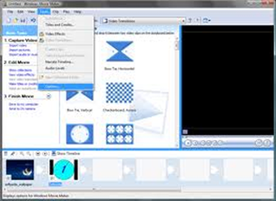

# Edición de vídeo

# Introducción

# Parámetros del vídeo digital

¿Cómo medimos la calidad o el tamaño de un vídeo?

# Programas de edición de vídeo

Existen diferentes programas y apps que permiten componer fragmentos de vídeo y a partir de ellos:

- Agregar audio, imágenes...
- Insertar texto
- Añadir efectos de vídeo y transiciones

Ejemplos:

- Windows Movie Maker (Windows)
- Openshot (linux)
- Otros...

También existen programas que nos permiten capturar la pantalla de nuestro ordenador para así grabarla o compartir lo que estamos viendo o jugando como:

- Camtasia
- OBS

De este modo se graban muchos de los videotutoriales y partidas de videojuegos que podemos encontrar en Internet.
