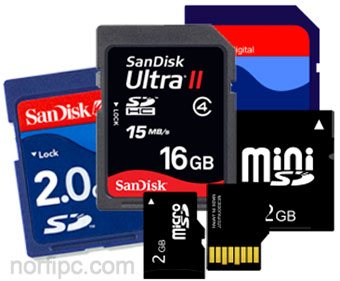
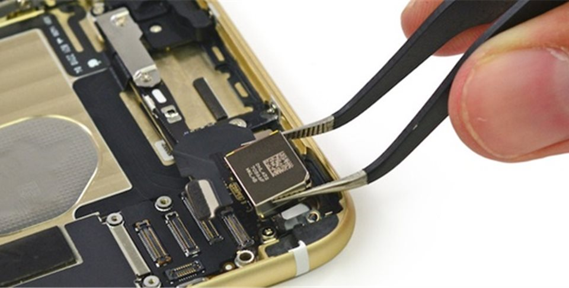
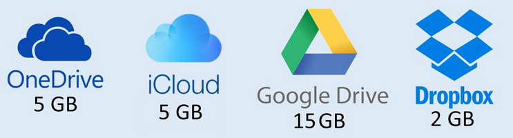

# Almacenamiento

## Tarjetas de memoria

Con la invención de las **tarjetas de memoria**, los vídeos se pasan a grabar en estas tarjetas. Las tarjetas se pueden intercambiar entre dispositivos, y gracias a ellas tenemos más espacio para guardar fotos o vídeos.

## Memoria interna

Los dispositivos tienen una **memoria interna** dentro, que no se puede extraer. Se utiliza para guardar las apps y el sistema operativo. Con el tiempo estas memorias se han hecho más grandes y, en general, ya no suele ser necesaria una tarjeta de memoria para guardar vídeo, fotos o música, sino que se guardan en la memoria interna del dispositivo.

## Servicios en la nube

Tanto las tarjetas como la memoria interna necesitaban de una conexión a un ordenador o portátil para poder editar el vídeo, así como guardarlo o subirlo a internet y compartirlo, generalmente mediante un cable tipo USB o firewire.

Hoy en día las **conexiones de datos** han aumentado de velocidad y las tecnologías inalámbricas o Bluetooth han permitido la conexión sin cable. Esto, junto a que las compañías ofrecen servicios de **almacenamiento en la nube** y las redes sociales, han permitido que el vídeo ya no sea necesario  enviarlo a otro dispositivo, sino que lo podemos grabar, editar y subir a Internet directamente.

Existen también plataformas de vídeo online, como **Youtube** o **Twitch** que permiten crear canales, suscribirse a ellos, y comentar, pareciéndose cada vez más a una red social propiamente dicha.

Estas plataformas han ido evolucionando y permiten también editar el contenido desde la propia página web, o por ejemplo la **transmisión en directo**.

