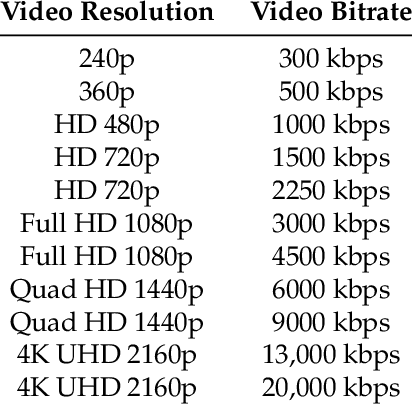

# Bitrate o taxa de bits

La taxa de bits, o ``bitrate`` en anglès, es refereix a la quantitat de dades que s'utilitzen per a representar una unitat de temps de vídeo digital. Es mesura en bits per segon (bps) o en kilobits per segon (kbps) i determina la quantitat de informació que es pot transmetre o emmagatzemar per segon.

Una taxa de bits més alta implica una`` millor qualitat`` de vídeo, ja que hi ha més informació per a representar els detalls de la imatge. No obstant, també implica:

- ``arxius més grans``
- ``Més amplada de banda necessària`` per a la transmissió de vídeo en línia.

## ¿De qué depèn?

La taxa de bits depèn de diversos factors, com ara:

- La ``resolució`` de vídeo
- La velocitat de fotogrames per segon (``fps``)
- La profunditat de color
- El ``codec`` de `compressió` de vídeo utilitzat

