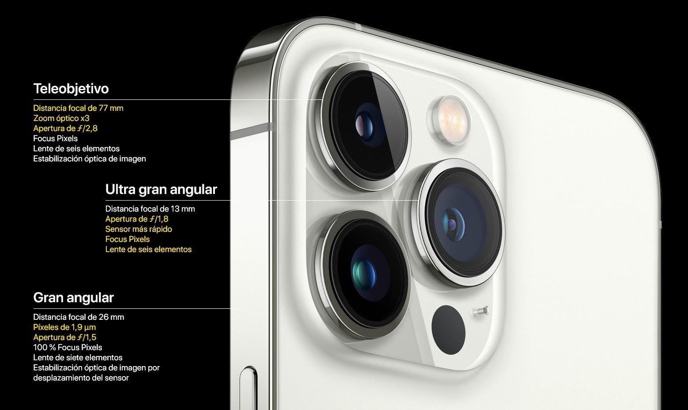
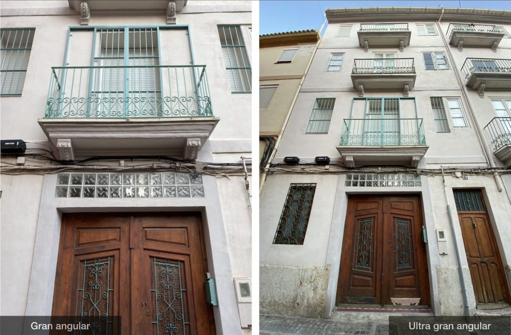
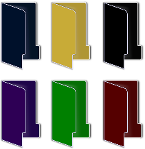

# 2. Grabación

## Dispositivos de captura

Para poder grabar vídeo, podemos utilizar diferentes dispositivos. La evolución en la captura de vídeo doméstico has sido la siguiente:

- Generalmente se han utilizado cámaras que grababan primero en cintas, y más adelante en mini DVDs. Las cámaras de vídeo y de fotos eran completamente independientes.

- Posteriormente aparecieron las **webcam**, que nos permitían conectarlas directamente a un ordenador y transmitir lo grabado, permitiendo las **videoconferencias**.
- Las **cámaras de fotos digitales** se volvieron más pequeñas y asequibles, y con el tiempo permitieron la grabación de vídeo.
- Por último, **teléfonos móviles y tablets** han ido incorporando también cámaras que permiten grabar vídeo y tomar fotos. Al tener estos dispositivos conexión a Internet integrada, el proceso de grabar y compartir las grabaciones se hace mucho más rápido.

Si asistimos a clases online o teletrabajamos con un ordenador, lo más práctico es una **webcam**. En el caso de portátiles, ya suele venir incorporada.

Si queremos streamear, nos conviene una webcam de mayor calidad.

También existen **drones** que nos permiten acoplar a ellos una cámara o directamente la incorporan, para tomar imágenes aéreas.

## Smartphone

Lo más habitual es grabar nuestros vídeos o reuniones a través del **smartphone**, por lo que nos conviene saber de qué es capaz. Las cámaras son uno de los factores más importantes a la hora de elegir uno u otro modelo, y son la principal diferencia entre gamas de móviles.

Los móviles más antiguos incorporaban una cámara trasera para fotografía y una frontal de menor calidad para videollamadas, selfies o faceID.

## Tipos de cámara

Actualmente es habitual encontrar que incorporan entre 3 y 4 módulos, que habitualmente son:

- Gran angular
- Super gran angular
- Teleobjetivo

## Diferencia entre angular y gran angular

El gran angular nos abrirá el campo de visión para que, de cerca, nos quepan más elementos en pantalla.

## Modos de vídeo

Según el tipo de cámaras que incorpora nuestro smartphone, tendremos diferentes modos de vídeo que podemos elegir desde la propia app de la cámara.

Por poner un ejemplo, los modelos de iPhone 13 Pro admiten grabación de

- Vídeo de hasta 4K a 24, 25, 30 y 60 FPS
- Video HDR con Dolby Vision a 4K de hasta 60 cuadros por segundo.
- Video de 1080p y 720p también están disponibles.

Desde dentro de la propia App de la cámara o en ajustes, podremos elegir la calidad de vídeo que queremos utilizar, en función de la situación y la finalidad del vídeo.

## Zoom

En fotografía, el zoom de la cámara se refiere a hacer que un sujeto aparezca más cerca o más lejos en una imagen. Hay diferentes tipos de zoom que utilizan diferentes teléfonos inteligentes:

**Zoom óptico**: se logra mediante el uso de una serie de elementos de lente. Las lentes de los teléfonos inteligentes no pueden moverse al zoom óptico, por lo que el teléfono cambia sin problemas a la cámara con el factor de aumento más alto.

**Zoom digital**: el zoom digital logra un efecto similar al zoom óptico, pero recorta áreas alrededor de la escena para que parezca que estás más cerca del sujeto.

## Estabilización

Un problema habitual en vídeo que no encontramos en fotografía es el de la estabilización. Conforme nos movemos, hay vibraciones, etc. El vídeo refleja esos movimientos y la calidad se resiente.

Antiguamente se empleaban estabilizadores, aunque hoy en día los móviles suelen tener programas internos que, utilizando el sensor de giro, corrigen la imagen para que se vea estable.

A modo profesional, se utilizan unos soportes llamados **gimbal**, que incorporan un mecanismo que hace que la cámara siempre esté en la misma posición, aunque nos movamos nosotros.

## Capturar la pantalla de nuestro ordenador, consola o nuestro smartphone

También podemos utilizar clips de vídeo ya existentes en internet, o vídeos que tengamos grabados previamente.

## Calidades

Si grabamos desde el móvil, podemos elegir diferentes calidades de vídeo. Los archivos se suelen guardar en formato mp4.Según la calidad elegida, el espacio que ocupa el vídeo variará. Por ejemplo, mi móvil tiene las opciones:

- 1080 (si no se dice nada suele ser 30 fps)
- 1080 60 fps
- 4K (30 fps)
- 4k 60 fps

Intentad que todos los vídeos estén grabados con la misma calidad. Una resolución de 1080 sería lo más adecuado.

Elegid una relación de aspecto igual en todas las tomas, la más recomendable es 16:9, para visualizarlo correctamente en cualquier dispositivo.

## Grabando tomas

Al grabar video para nuestro proyecto, realizaremos diferentes tomas. Cada una en un lugar concreto y con una finalidad concreta. Vale la pena tomar muchas tomas de sobra, para poder elegir a posteriori. Si luego necesitamos alguna, nos será más complicado volver a grabarla

Intenta combinar diferentes planos: panorámicos, primeros planos, detalle etc. Como vimos en el tema de fotografía. También varía la posición de la cama (picado, contrapicado, etc.)

Aquí puedes ver una explicación de los diferentes planos y encuadres, que te ayudarán:

📷 Taller fotografía

## Guardado

Una vez lo tengamos todo grabado, guarda todos los vídeos en un ordenador o en la nube, y haz copias para tenerlo guardado por si hubiera algún problema.

⚠️ Tened en cuenta que, si compartís fotografías o vídeos a través de WhatsApp o RRSS, estos archivos perderán calidad, por lo que no es lo recomendable.

También puedes conectar el móvil al PC con un cable para buscar los vídeos y extraerlos por USB.

Puedes subir los vídeos directamente a``YouTube`` o alguna red social sin necesidad de editarlo.

Puedes subirlo a Dropbox o Google drive, para poder descargarlos desde el ordenador.

Si vas a editar en PC, necesitarás pasar estos archivos desde el smartphone en primer lugar.

## Organización

Organiza los videos en carpetas, con diferentes nombres, como harías con otros documentos. De esta forma, será más fácil encontrarlos luego cuando hagas la edición.

## Clips en internet

Para crear nuestro video utilizaremos clips o pequeños fragmentos de vídeo y audio, que habremos grabado nosotros o descargados de internet.

La fase de edición se llama postproducción o montaje, y en ella colocaremos todos nuestros clips en diferentes pistas (tracks), los moveremos, recortaremos y aplicaremos efectos.

Podemos descargar vídeos de stock, que otros han creado para que los podamos incluir en nuestros propios proyectos.

- En esta página podéis encontrar muchos: Pexels Videos
- Para sonido: Mixkit
- Para imágenes: pixabay.com
