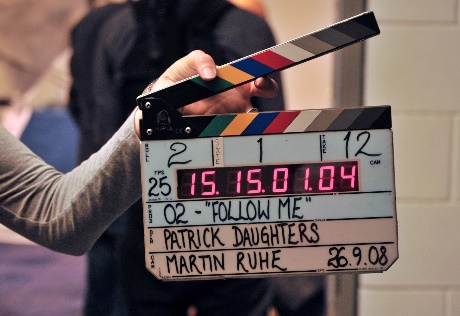
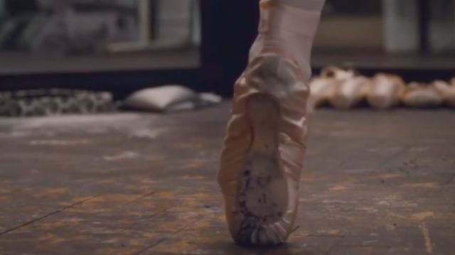

# 2. Grabación

## Capturar la pantalla de nuestro ordenador, consola o nuestro smartphone

También podemos utilizar clips de vídeo ya existentes en internet, o vídeos que tengamos grabados previamente.

## Grabando tomas

Al grabar video para nuestro proyecto, realizaremos diferentes tomas. Cada una en un lugar concreto y con una finalidad concreta. Vale la pena tomar muchas tomas de sobra, para poder elegir a posteriori. Si luego necesitamos alguna, nos será más complicado volver a grabarla

Intenta combinar diferentes planos: panorámicos, primeros planos, detalle etc. Como vimos en el tema de fotografía. También varía la posición de la cama (picado, contrapicado, etc.)

Aquí puedes ver una explicación de los diferentes planos y encuadres, que te ayudarán:

📷 Taller fotografía
