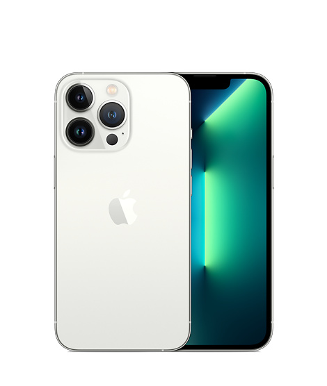

# Modos de vídeo

## Calidades

Si grabamos desde el móvil, podemos elegir diferentes calidades de vídeo. Los archivos se suelen guardar en formato mp4.Según la calidad elegida, el espacio que ocupa el vídeo variará. Por ejemplo, mi móvil tiene las opciones:

- 1080 (si no se dice nada suele ser 30 fps)
- 1080 60 fps
- 4K (30 fps)
- 4k 60 fps

Intentad que todos los vídeos estén grabados con la misma calidad. Una resolución de 1080 sería lo más adecuado.

Elegid una relación de aspecto igual en todas las tomas, la más recomendable es 16:9, para visualizarlo correctamente en cualquier dispositivo.

## Modos

Según el tipo de cámaras que incorpora nuestro smartphone, tendremos diferentes modos de vídeo que podemos elegir desde la propia app de la cámara.

Por poner un ejemplo, los modelos de iPhone 13 Pro admiten grabación de

- Vídeo de hasta 4K a 24, 25, 30 y 60 FPS
- Video HDR con Dolby Vision a 4K de hasta 60 cuadros por segundo.
- Video de 1080p y 720p también están disponibles.

Desde dentro de la propia App de la cámara o en ajustes, podremos elegir la calidad de vídeo que queremos utilizar, en función de la situación y la finalidad del vídeo.

