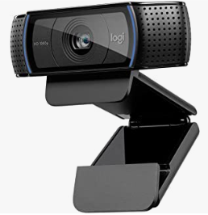
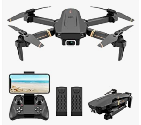
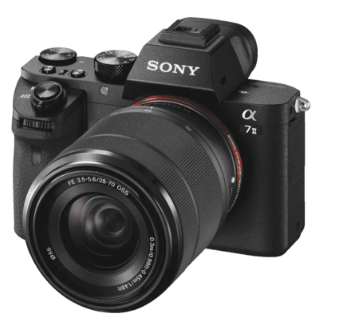
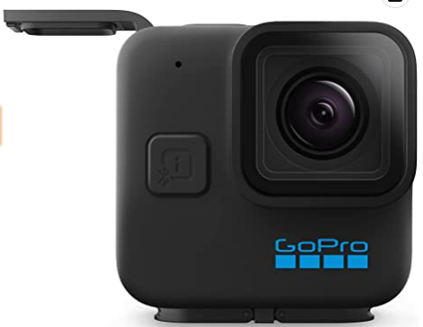

# Dispositivos de captura

Para poder grabar vídeo, podemos utilizar diferentes dispositivos. La evolución en la captura de vídeo doméstico has sido la siguiente:

## Evolución

- Generalmente se han utilizado cámaras que grababan primero en cintas, y más adelante en mini DVDs. Las cámaras de vídeo y de fotos eran completamente independientes.

- Posteriormente aparecieron las **webcam**, que nos permitían conectarlas directamente a un ordenador y transmitir lo grabado, permitiendo las **videoconferencias**.
- Las **cámaras de fotos digitales** se volvieron más pequeñas y asequibles, y con el tiempo permitieron la grabación de vídeo.
- Por último, **teléfonos móviles y tablets** han ido incorporando también cámaras que permiten grabar vídeo y tomar fotos. Al tener estos dispositivos conexión a Internet integrada, el proceso de grabar y compartir las grabaciones se hace mucho más rápido.

## Webcam

Si asistimos a clases online o teletrabajamos con un ordenador, lo más práctico es una **webcam**. En el caso de portátiles, ya suele venir incorporada.

Si queremos streamear, nos conviene una webcam de mayor calidad.

## Drones

También existen **drones** que nos permiten acoplar a ellos una cámara o directamente la incorporan, para tomar imágenes aéreas.

## Smartphone

Lo más habitual es grabar nuestros vídeos o reuniones a través del **smartphone**, por lo que nos conviene saber de qué es capaz. Las cámaras son uno de los factores más importantes a la hora de elegir uno u otro modelo, y son la principal diferencia entre gamas de móviles.

Los móviles más antiguos incorporaban una cámara trasera para fotografía y una frontal de menor calidad para videollamadas, selfies o faceID.

## Cámaras fijas

## GoPro

GoPro és una marca de càmeres d'acció, dissenyades especialment per a la captura de vídeo i fotografia en entorns esportius i d'activitats a l'aire lliure. La càmera GoPro és una càmera compacta, resistenta i portàtil, amb un angle d'enregistrament ample i una resolució d'alta definició.

La majoria de les càmeres GoPro són impermeables i es poden utilitzar sota l'aigua, el que les fa populars entre els aficionats a esports aquàtics com surf, busseig, i kayak. Les càmeres GoPro també són populars en esports terrestres com ciclisme, escalada, esquí i molts altres.