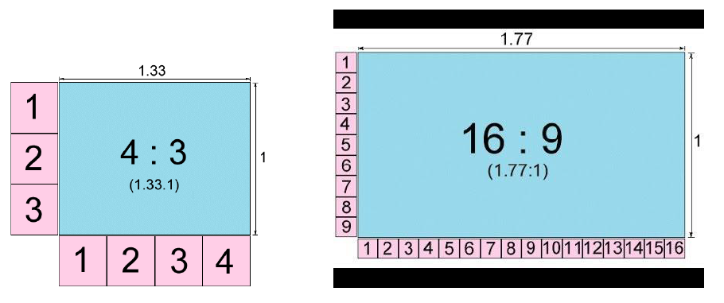
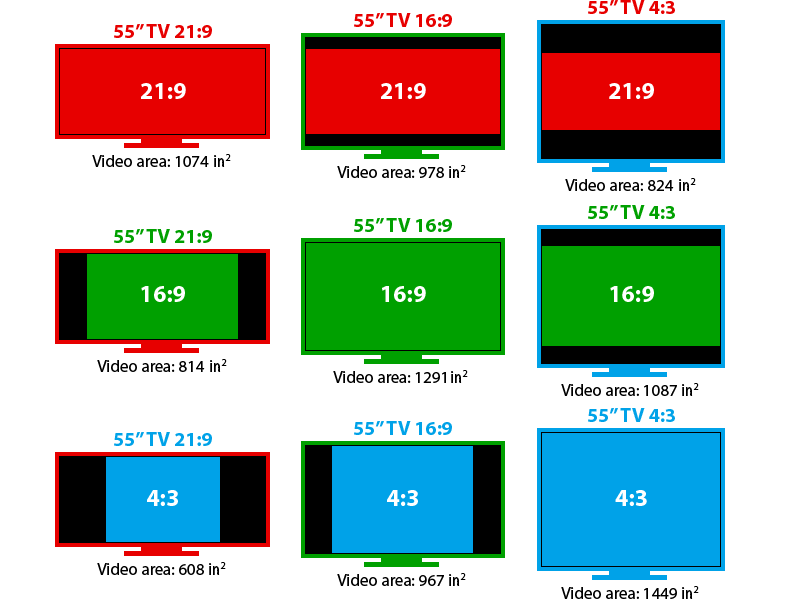

# Relación de aspecto

La relación de aspecto nos indica la proporción o relación entre anchura (x) y altura (y). Se expresa como x:y

- En la televisión tradicional esta ha sido siempre de 4:3, pues esta era la forma de las televisiones.
- Actualmente, debido a la alta definición se utiliza más el formato panorámico, más alargado y similar a la vista humana. El formato llamado panorámico es el de 16:9 o dieciséis novenos.

En caso de que el la relación de aspecto del vídeo y del móvil, televisión o dispositivo en el que lo esté viendo no coincida, se rellena con **bandas negras**.

