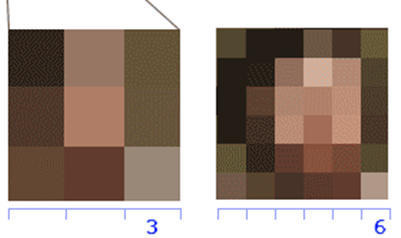

# Resolución

Define el máximo detalle que se puede obtener de la imagen y determina su calidad. El tamaño de la imagen se calcula como el producto de  píxeles horizontales y  píxeles verticales de la imagen.

Estas dos imágenes tienen una resolución de 3x3 y 6x6 píxeles.

Estas dos, de 10x10 y 15x15.

Si tuviéramos más píxeles, como en una imagen de 1280 x 720, la calidad sería mucho mejor y tendría más definición. Por contra, ocuparía más espacio. Esta imagen tendría una resolución de 921.600‬ de píxeles. A llegar a 1.000.000, se cuentan por millones de píxeles o **megapíxels**.

Para indicar la resolución de una imagen se utiliza habitualmente solo los **píxeles de la vertical** seguidos de una letra:

- P si el video es progresivo
- I si el video es entrelazado

Por ejemplo, los vídeos en fullHD tienen una resolución de 1080p. Esto significa que la imagen mide 1080 píxeles en vertical y el video es del tipo progresivo.

