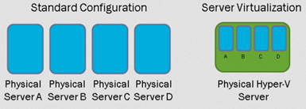
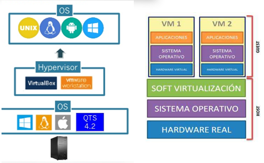

# Virtualización

## Concepto de virtualización

### De qué se trata

Creación a través de **software** de una versión virtual de un **recurso** tecnológico

### Usos de la virtualización

- Probar otros sistemas operativos
- Ejecutar programas antiguos
- Utilizar aplicaciones de otros SO
- Probar aplicación en diferentes sistemas

### Ventajas de virtualizar

- Aprovechamiento de recursos
- Escalabilidad y disponibilidad
- Reducción de coste y consumo
- Copias de seguridad sencillas
- Seguridad

## Componentes de la virtualizción

### Anfitrión (HOST)

Equipo sobre el que se ejecuta todo el sistema de virtualización

### Huésped (GUEST)

- Lo que se virtualiza sobre el anfitrión
- Lo más habitual suelen ser máquinas virtuales
- Sobre un HOST se pueden ejecutar 1 o más GUEST

### Hypervisor (VMM)

- Es el software que permite llevar a cabo la virtualización
- Me deja crear las máquinas virtuales, definirlas, manipularlas
- Ejemplo: virtualbox

## Tipos de virtualización

### Virtualización de recursos

No se trata de simular un equipo concreto, sino una parte de él, como por ejemplo:

- Volúmenes de almacenamiento (a partir de discos físicos)
- Recursos de red

Ejemplos:

- Sistemas RAID
- Redes VPN
- Almacenamiento en red (SAN)
- Computación en la nube (Cloud computing)

### Virtualización de plataforma

- En este caso se simula un ordenador completo con su propio SO
- Se crea una MV combinando HW y SW

Tipos principales:

- Emulación
- Virtualización nativa
- Virtualización asistida por hardware

## Tipos de virtualización de plataforma

### Emulación

- Sucede cuando la arquitectura de **host** y **GUEST** es completamente diferente
- Ejemplos:
  - GUEST: ARM y HOST: procesador x64
  - GUEST: PowerPC y HOST: x86

Se simula todo el hardware (completo)

- Software: QEMU, MAME, Bochs

### Virtualización nativa

- En este caso las arquitecturas de el **host** y el **guest** son idénticas
- El software simulado es la parte del hardware que no tienen en común
- Ejemplos de software:
  - VirtualBox, QEMU, Hyper-V, VMWare

### Virtualización asistida por hardware

- Se trata de un tipo de virtualización nativa
- El procesador del HOST contribuye a la virtualización
- Para ello es necesario disponer en el procesador preparado para virtualización:
  - Tecnología AMD-V
  - Intel VT-x
- Las opciones de virtualización deben estar habilitadas desde la BIOS

## Tipos de hipervisor

### Tipo 1: Hipervisor alojado o hosted

El **hipervisor** es un programa que se ejecuta sobre SO del **host**

Los ejemplos más habituales de hipervisores de este tipo son:

- VMware
- Virtual PC (Microsoft)
- VirtualBox (Oracle)

### Tipo 2: Hipervisor nativo o bare metal

- El hipervisor se instala y ejecuta directamente sobre el hardware del equipo
- No existe ningún SO intermedio instalado
- Ejemplos:
  - VMware ESX
  - Hyper-V (Microsoft)
  - Citrix XenServer
  - Oracle VM

