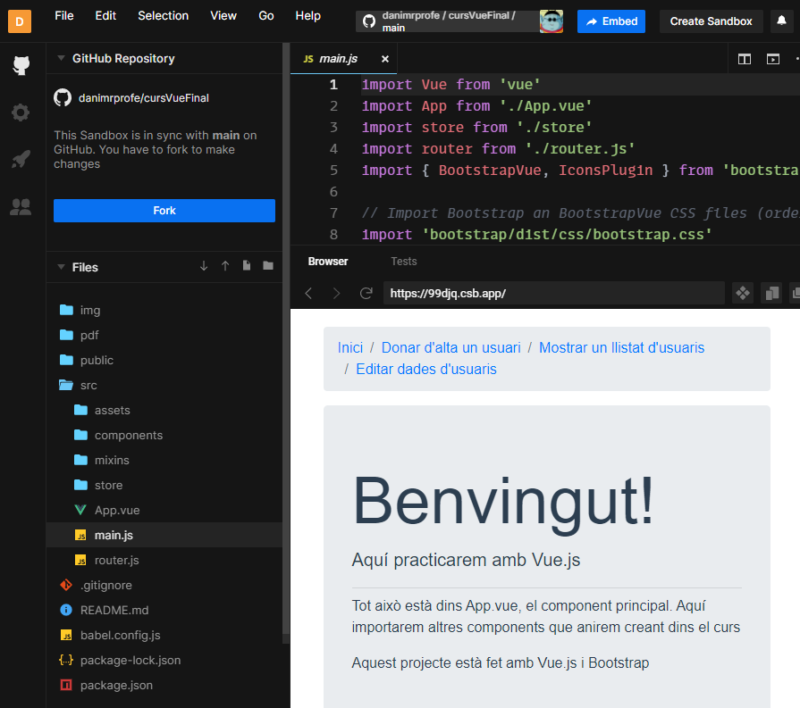
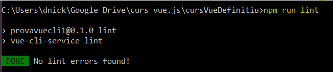

# Vue.js

He estado probando el framework Vue.js (se pronuncia «viu») y os voy a contar mis impresiones. No se trata de ningún manual, que de esos hay muchos.

Vue es un framework hecho en Javascript para crear webs. Vue integra un montón de librerías javascript para hacer más fácil organizar y simplificar el desarrollo.

## Una pequeña muestra de Vue

Si queréis ver una muestra de una web hecha con Vue (tendréis que esperar un poco a que se despliegue el proyecto). Esta web (codesandbox.io) nos permite crear un entorno para hacer pruebas online (sandbox) e incluso lo podemos enlazar a un repo de GitHub para que coja el proyecto desde ahí, así siempre ejecutaremos la última versión que hayamos pusheado.

https://codesandbox.io/s/github/danimrprofe/cursVueFinal



## ¿Qué puedo hacer con Vue?

Vue nos ayuda a crear una aplicación web reactiva. esto significa que la página cambia cuando los datos de la página web cambien, sin recargarse la página. Es decir, que si clicamos un botón, o escribimos algo, nuestra página cambia su contenido en directo, sin recargarse. Esto ya se podía hacer con otras tecnologías, y Vue.js es una más.

## ¿Es fácil o difícil comenzar con Vue?

Respuesta rápida: si hace años que no te dedicas a esto, las pasarás un poco canutas. Si has probado otros frameworks como react o angular, ya llevas algo ganado.

Yo aprendí a crear webs a torta limpia. Es decir, bloc de notas, html, javascript, y poco más. Todo programación del lado cliente, sin backend ni nada. Javascript solo se utilizaba en el navegador del cliente, y poco más, para cambiar cosas, pero sin conectar al servidor. Luego que si php, jsp, vb.net y otras historias en el servidor generaban dinámicamente html que se enviaba al cliente.

Esto es otro nivel, JavaScript está hasta en la sopa y la web completa se crea con JavaScript , tanto en cliente como en servidor. A esto nos ayudan los frameworks, para no tener que hacer las webs de cero, y nos dan muchas herramientas ya prefabricadas, con las que nosotros nos podemos montar nuestra web.

Pero vamos, que si no sabes nada de javascript, has vendido cromos. Por lo menos lo básico de su funcionamiento. Por suerte, existe: una web oficial con documentación a cascoporro, guías, faqs que, junto con``YouTube`` y stackoverflow os pueden ayudar a salir adelante.

## Componentes Vue.js

Al final una web tiene x páginas (por ejemplo: login, lista, registro, etc). Aunque no las veamos así desde el navegador, en servidor esto acaba en archivos individuales, cada uno con su código. Cada página está creada a partir de pequeños trozos llamados componentes vue, que podemos reutilizar en varias páginas. Nosotros los creamos, y luego los incluimos con unas etiquetas especiales en las páginas que queremos. Un componente puede ser:

- Un formulario
- Una tabla con información
- Un menú de navegación
- Etc.

Una vez creados, los incluyo en las páginas que quiero, y listo

## Vue CLI

Se trata de una herramienta muy útil para evitar trabajar de más. Vuecli es una interfaz que nos permite ejecutar comandos que nos ayuden a crear la estructura base de nuestro proyecto Vue (guía aquí)

Para ello, nos tenemos que instalar un paquete npm que nos dará acceso a los comandos a través de nuestra terminal. Algunos comandos:

- Con vue create nos hace la estructura base de nuestra web
- Con vue serve arrancamos el proyecto.
- Otras herramientas (vuex, vue-router, mixins)

Además de Vue.js, podemos incluir más herramientas a nuestro proyecto para hacerlo crecer. Por ejemplo:

Vuex nos permite guardar el estado de la página (todas las variables) en un almacén o store separado (un archivo aposta), para que sean accesibles desde todos los componentes.
Con Vue-router podemos definir una navegación por la aplicación. A partir de ciertas palabras que incluyamos en la url (www.hola.com/info), las mapearemos con el componente que queramos que se muestre (../../informacion.vue). También podemos aprovechar esto para pasar parámetros y otras historias. Esto lo he utilizado para navegar por el site sin recargar la página.
Podemos incluir en nuestro código mixins, que nos permiten almacenar parte de código de Vue para poder reutilizarlo en en múltiples componentes al mismo tiempo, evitando repetir bloques de código a cada uno de ellos.

## Guardar el proyecto

Una vez creado el proyecto, lo tendremos que guardar en algún sitio. Yo personalmente tiro de GitHub. Me creo un repositorio, lo inicializo en local, commit y lo pusheo. Cuando lo necesite, hago clones o checkouts y lo resubo, y así siempre tengo la última versión online. También puedo linkar el repositorio a algún servicio cloud para que me coja de ahí el proyecto y me lo ponga en marcha.

## El tamaño importa

Según la cantidad de paquetes que utilicemos, el proyecto puede ser enorme. Además, como son miles de paquetes muy pequeños, mover o copiarlos es larguísimo, además de ocupar espacio innecesario.

Por ello, los paquetes y las builds no se suben. Cuando despleguemos nuestra web en produccion ya se descargarán e instalarán todos, por lo que no necesitamos incluirlos. Con un .gitignore nos quitaremos todo este peso de encima, y básicamente subiremos las carpetas que hemos creado con Vue.

Vamos a ver como arrancar el proyecto una vez descargado en local.

## Desplegar el proyecto en local

Una vez descargados los archivos del proyecto, este se tendrá que instalar. En este proceso se descargarán e instalarán todos los paquetes necesarios para que este funcione (dependencias). Para ello utilizaremos el comando, en la carpeta raíz:

```bash
npm install
```


Al terminar nos informará de todos los paquetes instalados, y si existe alguna vulnerabilidad en nuestro proyecto. Los paquetes «this version has been deprectated» son versiones obsoletas y que por tanto no se recomienda usar.

Vemos también que no existe ninguna vulnerabilidad conocida en nuestro proyecto


## Arrancar el servidor

Para arrancar el proyecto, utilizaremos el siguiente comando, que nos abrirá un servidor escuchando en el puerto 8080 de nuestra máquina, al que accederemos desde el navegador.

```bash
npm run serve
```


Como podemos ver, podremos acceder a través de dos direcciones, una de localhost y otra con dirección IP. Podemos pinchar en los enlaces celestes y nos arrancará el proyecto.
Como curiosidad, cada vez que guardemos, «compilará» el proyecto y, si encuentra algún fallo, no nos dejará testearlo hasta que no lo hayamos arreglado. Si no hay errores, ser «refrescará» el proyecto y veremos en el navegador siempre la última versión guardada.

Compilar y minimizar el proyecto Vue para producción
Si queremos desplegar nuestro proyecto para producción, podemos crear una build, es decir, una versión de nuestro proyecto para un entorno de producción.

Para ello utilizaremos el comando

```bash
npm run build
```

Esto nos creará una carpeta nueva llamada dist, y empaquetará la aplicación para que ocupe menos. Nos gzipea los archivos, por lo que el tamaño se reduce considerablemente. De paso, nos mostrará algunos warnings con recomendaciones para optimizar el rendimiento.


Mirando el contenido el contenido de la carpeta dist, vemos que nos crea un HTML, una carpeta CSS y otra para el código Javascript


## Linting de nuestro proyecto Vue

También tenemos un comando que nos busca errores y malas prácticas dentro de nuestro proyecto. En general, si nuestro proyecto compilaba y no daba errores, no nos tocaría encontrar ningún problema.

npm run lint


