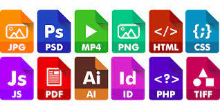

# Estructura de un sitio web

## Páginas web y sitios web

Una web, sitio web o website está formado por varias **páginas web** enlazadas entre sí. La web del instituto es www.iesramonllull.net, y dentro existen varios archivos, como “noticias”, “horarios”, etc.

Cada uno de ellos es una página web, un archivo guardado en un servidor web y al que cualquiera puede acceder

Los documentos que componen el sitio web son archivos y carpetas que contienen texto, imágenes, botones, animaciones, tablas, gráficos, videos, etc.

## Estructura
Una web se compone de muchas páginas, organizadas en carpetas, como si de una carpeta de windows se tratase. Estas páginas son realmente archivos de texto. Una organización podría ser:

- horario
    -  1bachillerato.html
    -  2bachillerato.html
- Contacto
  - Telefono.html

De este modo, si accedemos a www.mipagina.es/horario/1bachillerato.html, estamos accediendo a ese archivo en concreto.

## Extensión .html

La extensión .html indica que el lenguaje con el que se ha escrito ese archivo es HTML, uno de los múltiples lenguajes para programar páginas web. Existen otras como .php, .jsp, etc.

## Ver el código fuente de una página web

El contenido de estas páginas web se envían a nuestro navegador, y él lo lee y “pinta” toda la página, colocando cada texto, imagen, etc. en el lugar correspondiente.

Lo que vemos en el navegador es la representación de la página, que se genera a partir del código fuente. Podemos verlo en un navegador pulsando Ctrl+U
Esa página que estamos viendo, por dentro tiene una forma muy diferente, según el lenguaje que utilice. Si queremos ver cómo es en realidad, los navegadores nos permiten ver el código fuente.
