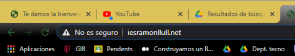
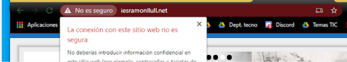
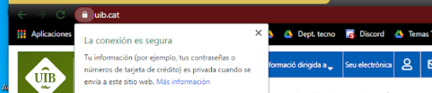

# Direcciones URL, HTTP y HTTPS.

## La dirección o URL

A menudo buscamos información en Google directamente y, a partir de ahí, navegamos de página en página, abriendo diferentes enlaces, hasta encontrar aquello que buscamos.
Realmente, cada página tiene una dirección única a nivel mundial, como la dirección de tu casa. Esta dirección se llama URL
- La dirección URL del instituto es: http://www.iesramonllull.net/. Cualquiera que escriba esto en la barra de direcciones, llegará a la página del instituto, desde cualquier lugar del mundo.
- La URL comienza siempre por http://, aunque si no se pone funciona igualmente.

## HTTPS

Esta dirección indica el sitio web y la ruta hacia la página concreta:
https://www.marca.com/baloncesto/nba.html
Te habrás dado cuenta que empieza por HTTPS y no HTTP. Eso significa que es una conexión segura y encriptada, por lo que nadie podría ver lo que estás enviando a esta página web, entre otras cosas.
⚠️ Fíjate siempre que las páginas que visites comiencen por HTTPS.
Ejemplo de página no segura

Ejemplo de página segura

