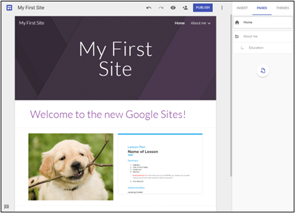
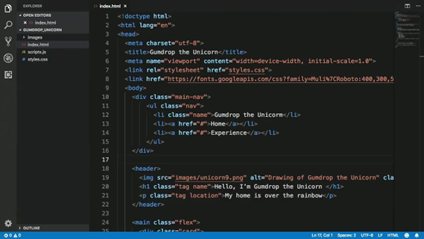
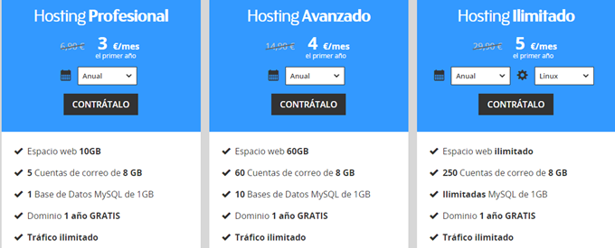

# Crear una web

## CREADORES DE WEBS ONLINE

Podemos crear una página web sin conocimientos de programación, utilizando páginas que nos ofrecen crear una web en base a plantillas que ellos ya nos dan hechas, y que podemos modificar y personalizar a nuestro gusto. Por ejemplo:

- Blogs: Wordpress.org
- Google sites: Google sites
- Wix: https://es.wix.com/

Algunas ofrecen servicios gratuitos con ciertas limitaciones, y otros planes de pago más orientados al mundo profesional.

## ENTORNOS DE DESARROLLO

Las páginas web se pueden hacer con muchos programas diferentes. Cualquiera que sirva para el texto, servirá para hacer una página web, incluso el bloc de notas.

- Editores online: Online HTML Editor - 𝗛𝗧𝗠𝗟-𝗢𝗻𝗹𝗶𝗻𝗲.𝗰𝗼𝗺
- De texto (Brackets, sublime text, atom)
- Visuales WYSIWYG (Kompozer)
- Entornos IDE (VS Code)
- Gestores de contenidos (Joomla, Wordpress)
- Visual studio Code y extensiones para HTML. Previsualización

La mayoría de estos programas tienen extensiones, pequeños programas que podemos añadirle para hacer más fácil la tarea de programar.

## LENGUAJES

Existen muchos lenguajes de programación para crear una página web. No tienen porqué usarse todos, depende de lo que necesitemos hacer. Los más utilizados son:

- Servidor: Java, SQL
- Cliente: HTML, CSS, JavaScript

En los estudios correspondientes, se enseñan varios lenguajes y cómo combinarlos. Piensa en ellos como diferentes “idiomas”.

## HOSTING

Las páginas que creemos se tienen que colocar en un ordenador que todo el mundo pueda ver, no puede ser el nuestro, al menos no de momento. Las tenemos que subir a otro ordenador llamado servidor, al que sí se puede acceder desde cualquier ordenador.

Normalmente no tendremos un servidor nuestro, pero algunas empresas sí lo tienen y nos dejan subir allí los archivos de nuestra página web. Este servicio se llama hosting y en general es de pago, aunque a veces nos ceden un poco de espacio gratuitamente para que lo probemos.

Además, para que nuestra página sea más fácil de encontrar, nos conviene contratar un dominio, una dirección universal para nuestra página web.
