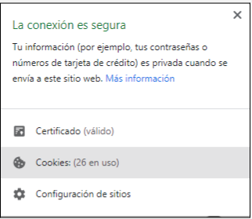
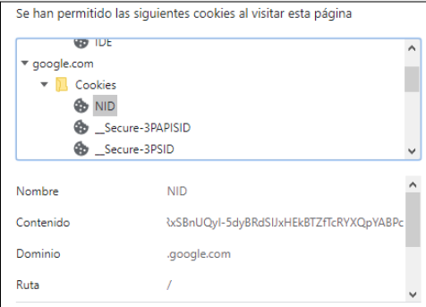

# Cookies

Las cookies son pequeños trozos de información que las webs guardan en nuestro ordenador, a modo de recordar cosas sobre nosotros la siguiente vez que nos conectemos a ella u otras páginas. Pinchando en el candado que aparece al lado de la dirección URL, podemos ver la información de cookies para esta página.

Hoy en día es obligatorio que cualquier sitio web nos informe sobre qué información almacena en cookies y para qué, y somos nosotros si permitimos o no usarlas.

## Ejemplo de cookies en YouTube

En Google utilizamos cookies y otros datos para proporcionar, mantener y mejorar nuestros servicios y anuncios. Si aceptas, personalizaremos el contenido y los anuncios que ves en función de tu actividad en nuestros servicios, como la Búsqueda, Maps o YouTube. También contamos con partners que miden cómo se usan nuestros servicios. Haz clic en "Ver más" para consultar tus opciones o visita g.co/privacytools en cualquier momento.