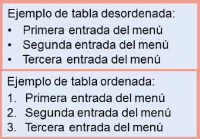

# Listas


Una lista permite organizar un documento HTML estructurándolo de la
forma más clara posible, para hacerlo más perceptible al lector.

Las listas se utilizan para dividir el documento así como para efectuar numeraciones de objetos.

HTML define varios tipos de listas: **ordenadas** y **no ordenadas**



## Listas no ordenadas

```html
<ul> Elementos de la lista </ul>
```

Los elementos de la lista irán precedidos por un símbolo (fijo por defecto) que
puede variar según el nivel de anidamiento de la lista. Cada elemento de la misma
llevará la etiqueta: <LI> Primer elemento </LI>

Ejemplo de lista no ordenada:

```html
<ul>
    <li>Aceite</li>
    <li>Cebolla</li>
    <li>Ajo</li>
</ul>
```

## Listas ordenadas

```html
<OL> Elementos de la lista </OL>
```
La etiqueta `<OL>` se utiliza para una lista ordenada o numerada. Cada marca
`<LI>` incrementará el número que se visualizará delante del elemento de la lista.

Ejemplo de lista numerada:

Por ejemplo:

```html
<ol>
    <li>Echar el aceite y calentar</li>
    <li>Añadir cebolla y remover</li>
    <li>Pijar ajo y agregarlo</li>
</ol>
```

Las listas numeradas no sólo se pueden ordenar con números. También se
pueden utilizar letras y numeración romana tanto en mayúsculas como
minúsculas.

Para esto se utiliza el comando TYPE de la etiqueta `<OL>` con los
siguientes valores:

- TYPE=1, (por defecto) para números.
- TYPE=A, para letras mayúsculas.
- TYPE=a, para letras minúsculas.
- TYPE=I, para numeración romana en mayúsculas.
- TYPE=i, para numeración romana en minúsculas.