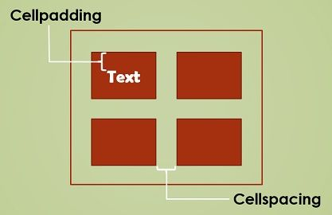

# Tablas

Las tablas son una parte importante en HTML y se utilizan para presentar datos en una forma estructurada. En HTML5, se ha mejorado el soporte para tablas con nuevas etiquetas y atributos. Esta guía explicará cómo crear tablas en HTML5.

## Etiquetas

La etiqueta general, que engloba a todas las demás es ``<TABLE>`` y ``</TABLE>``.
```html
<TABLE>
[Resto de las etiquetas]
</TABLE>
```

Las etiquetas más comunes para crear tablas en HTML5 son:

- ``<table>``: Esta etiqueta define la tabla y contiene todas las demás etiquetas en su interior.
- ``<thead>``: Esta etiqueta define la cabecera de la tabla. La cabecera contiene el título y los encabezados de la tabla.
- ``<tbody>``: Esta etiqueta define el cuerpo de la tabla. El cuerpo contiene todos los datos de la tabla.
- ``<tr>``: Esta etiqueta define una fila en la tabla.
- ``<th>``: Esta etiqueta define un encabezado de columna en la tabla
- ``<td>``: Esta etiqueta define una celda en la tabla.

## Filas y columnas

Indicamos el comienzo de la primera fila con la etiqueta ``<tr>``, y después marcamos en cuantas celdas dividiremos la fila con la etiqueta ``<td>``. Para finalizar cada celda y cada fila cerraremos la etiquetas ``</td>`` y ``</tr>``. La estructura quedará de la siguiente forma:

```html
<TABLE BORDER=1>
<TR>
<TD>fila1-celda1</TD>
<TD>fila1-celda2</TD>
<TD>fila1-celda3</TD>
</TR>
<TR>
<TD>fila2-celda1</TD>
<TD>fila2-celda2</TD>
<TD>fila2-celda3</TD>
</TR>
</TABLE>
```

## Atributos

Las etiquetas de tabla también pueden tener atributos. Los atributos más comunes son:

- **border**: Establece el tamaño del borde de la tabla.

```html
<table border="1">
```

Podemos cambiar el espacio dentro de las celdas o entre celdas con estas dos propiedades:

- **cellpadding**: Establece el tamaño del relleno de la celda
- **cellspacing**: Establece el tamaño del espacio entre las celdas

```html
<table cellspacing="2" cellpadding="3">
```



- **width**: Establece el tamaño de la tabla.
- **align**: Establece la alineación de la tabla.

```html
<table align="left" border="1">
  <tr>
    <td>Agua </td><td>1 l</td>
  </tr>
    <tr>
      <td>Leche desnatada</td><td>200 ml</td>
  </tr>
</table>
```

- **bgcolor**: Establece el color de fondo de la tabla o de una celda

```html
<td bgcolor=“red”>
```

## Ancho y alto

El valor de estos atributos se especifica en **píxeles**. Cuando no se les asigna ningún valor explícitamente estos atributos tomarán valores definidos por defecto.

Se puede determinar el tamaño de la tabla, bien forzándola a ocupar un
cierto porcentaje de la anchura de la ventana del navegador o definiendo un
tamaño fijo en unidades, mediante los atributos:

- ``WIDTH``: define el ancho de la tabla, bien en % o en unidades.
- ``HEIGTH``: define el alto de la tabla, bien en % o en unidades.

## Combinar celdas

Podemos romper la organización de filas y columnas combinando celdas para formar una sola. Para ello existen los atributos:

- ``colspan``: define una celda con una anchura múltiplo de la columna básica.
- ``rowspan``: define una celda con una anchura múltiplo de la fila básica.
