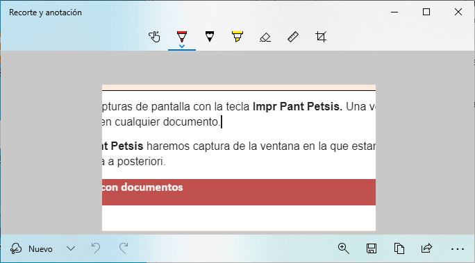

# 1. ESCRITORIO Y VENTANAS

A partir de ahora nos vamos a centrar en los sistemas operativos de escritorio. Es decir, Windows 10, Ubuntu y similares.

## Escritorio

Es el área de trabajo en la pantalla del ordenador que simula un escritorio real. En inglés se denomina Desktop. Cada usuario tiene el suyo y es personalizable.

Para abrir directamente el escritorio, Win + D. Las ventanas abiertas se minimizan para poder ver el escritorio. Si volvemos a pulsar estas teclas, se volverán a colocar como estaban.

Tiene una carpeta propia en el disco duro, a la que podemos llegar utilizando el explorador de archivos

## Explorador de archivos

Para abrir el explorador de archivos, Win + E

En la parte superior del explorador podemos encontrar algunas opciones.

Para cada carpeta o archivo, podemos ver información como la fecha de modificación o el tamaño, entre otras propiedades.

## Ventanas

Cada programa que ejecutamos se abre dentro de una ventana, por lo que necesitaremos trabajar en varias ventanas al mismo tiempo.

Maximizar, minimizar, cerrar y pantalla completa

Podemos mover, cerrar, pantalla completa (maximizar y minimizar), directamente desde la barra superior de la ventana, directamente con el ratón.

### Cerrar ventanas

Para cerrar la ventana, podemos utilizar ``ALT+F4``. Cuando no queden ventanas por cerrar, se nos pedirá si queremos cerrar el equipo.

### Pantalla completa

Podemos hacer que una ventana se muestre a pantalla completa con ``F11``. En general, esto nos permitirá visualizar más contenido en pantalla, al esconder algún menú.

### Modificar tamamaño

También podemos maximizar y minimizar las ventanas con la tecla WIN + flecha arriba o abajo.

Si hacemos doble clic en el título de la ventana se hará grande o pequeña directamente.

### Cambiar entre ventanas

Las ventanas pueden estar unas encima de las otras. Para poder visualizarlas, a veces tenemos que cerrarlas, recolocarlas o minimizar otras.

Podemos movernos entre ventanas lo más efectivo es utilizar Alt + Tab. En este caso, tengo 4 ventanas para moverme por ellas.

### Alinear pantallas

También podemos alinear las pantallas automáticamente para que ocupen la mitad de la pantalla.  Tecla ``Win + flecha izquierda o derecha``

Además, pulsando y arrastrando la línea divisoria, podemos dar más o menos espacio a cada una de las ventanas.

## Duplicar ventanas

Con cualquier ventana abierta, pulsando ``Ctrl + N`` podemos duplicar esta ventana y crear rápidamente una nueva.

## Modificar orientación de la pantalla

Podemos cambiar la orientación de la pantalla con las teclas ``Ctrl+Alt+flecha abajo``.

Si probamos con las demás flechas, podemos tener hasta 4 orientaciones diferentes.

### Personalización del escritorio

Cada usuario puede modificar el aspecto de su escritorio para adaptarlo a sus necesidades.

Por ejemplo, podemos modificar:

- Resolución de pantalla
- Tamaño de texto y elementos
- Personalizar temas
- Fondo de escritorio
- Color de ventanas
- Sonidos
- Protector de pantalla
