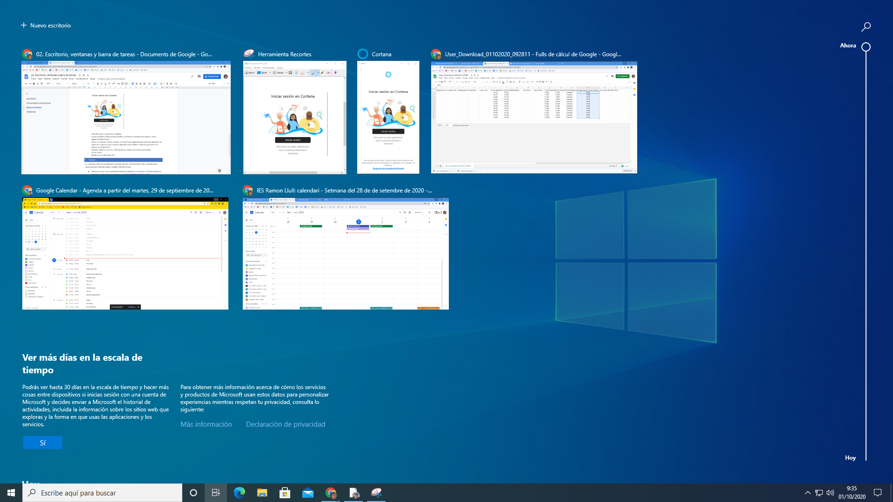
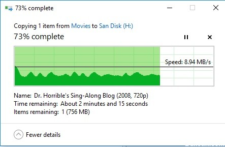
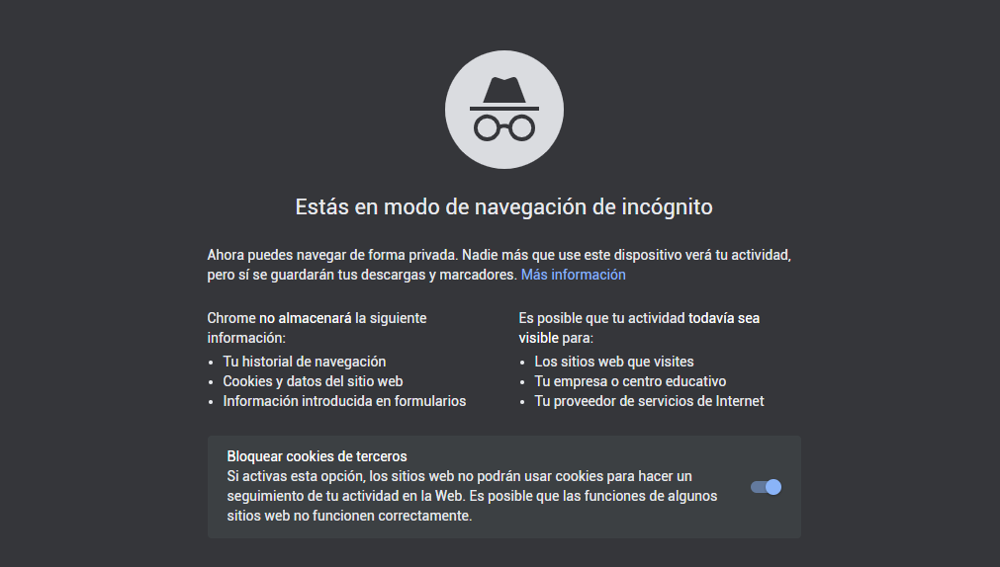
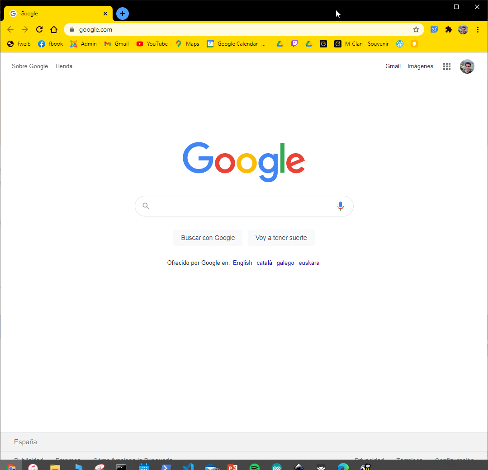
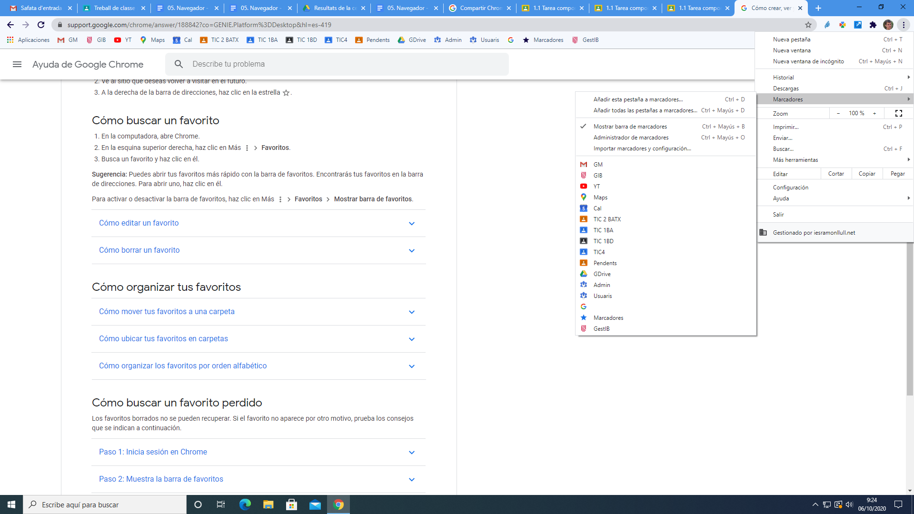

# Navegadores

---

## Páginas y sitios web

Una web o página web es en realidad un sitio web (website) formado por varias páginas web enlazadas entre sí.

Los documentos que componen el sitio web son archivos y carpetas que contienen texto, imágenes, botones, animaciones, tablas, gráficos, videos, etc.

Para navegar pode las diferentes páginas web, utilizamos un navegador o browser.

---

## Navegadores

Los navegadores son programas que nos permiten acceder a internet. Cada vez más aplicaciones funcionan directamente a través de páginas web, como por ejemplo las herramientas de Google Suite, el correo electrónico, las redes sociales, etc.

Los navegadores más populares son:

Internet Explorer (ahora Edge), viene instalado con los sistemas operativos Windows por defecto

Mozilla Firefox, libre y gratuito, hecho por la fundación Mozilla.

Google Chrome

Safari, instalado por defecto en equipos de Apple.

Otros (Opera, etc.).

Ventanas y pestañas

Cada vez que abramos un navegador como Chrome o Firefox, se abrirá una ventana diferente. Las ventanas son independientes unas de otras. Cada programa se ejecuta en su propia ventana, y se pueden ocultar, mostrar, o cambiar de tamaño.

Utilizar diversas ventanas suele ser muy incómodo, sobre todo a la hora de movernos por ellas. Para solucionarlo se utilizan las pestañas o tabs.

---

## Trabajo con ventanas y pestañas

Crear ventana: ``Ctrl`` +N

Crear pestañas: ``Ctrl`` +T

Cerrar tabs o ventanas: ``Ctrl`` + W

Abrir última pestaña cerrada: ``Ctrl`` +``Shift``+T

Moverse entre pestañas: ``Ctrl`` + TAB

Para moverse a una pestaña concreta: ``Ctrl`` + 1, ``Ctrl`` +2, etc.

---

## Descargas

Cuando descargamos un archivo, podemos decir que se abra directamente, o bien guardarlo. En el caso de guardarlo, estará en la carpeta Descargas del usuario en el que estemos (podemos ir con el explorador)

---

Para acceder a todas las descargas en Google Chrome: ``Ctrl`` + J

---

## Pantalla completa

Podemos ampliar el navegador para que la página ocupe toda la pantalla con F11. Podemos salir de este modo con F11 de nuevo.

---

## Buscar dentro de la página

En ocasiones nos puede resultar útil buscar una palabra en un documento. Para ello, podemos pulsar ``Ctrl``+F.

Para pasar entre todos los resultados encontrados podemos utilizar las flechas. En este caso, hay 3 coincidencias en el documento para la palabra historial.

---

## Historial

El historial contiene todas las páginas que hemos visitado desde ese usuario en el ordenador. Puede resultarnos útil para recordar páginas que hemos visitado, aunque podemos querer borrarlo por privacidad. Para acceder a él: ``Ctrl`` + H.

---

## Ver código fuente

Las páginas web están diseñadas con lenguajes de programación y el navegador las pinta para que las podamos ver correctamente. Si queremos ver el código fuente de una página web lo podemos hacer con ``Ctrl`` + U

---

## Cambiar tamaño de letra

Aumentar tamaño de letra: ``Ctrl``+RUEDA o ``Ctrl``+ + o -

Si queremos volver a tener el tamaño original, podemos hacerlo con ``Ctrl`` + 0

---

## Buscar en Google

Para acceder directamente a la barra de búsqueda de google, podéis hacerlo pulsando ``Ctrl``+E.

---

## Recargar

En ocasiones podemos querer refrescar la página (recargar), bien porque queremos actualizar el contenido, o porque se ha quedado colgada y no carga bien.

Para ello tenemos varias opciones, como hacer clic en la flecha circular o con ``F5`` o ``Ctrl`` + ``F5``

---

## Imprimir y guardar como pdf

Podemos imprimir una página (``Ctrl`` + P) por la impresora o bien guardarla en formato pdf.

---

---

## Modo incógnito

El modo incógnito, al que también podemos acceder con las teclas ``Ctrl``+``Shift``+N, nos abre una nueva pestaña con algo más de privacidad. A continuación puedes ver las diferencias entre este y el modo normal.

---

---

## Perfiles

Los perfiles te permiten separar toda la información de Chrome, como los marcadores, el historial, las contraseñas y otros ajustes

Los perfiles son ideales para:

- Compartir un ordenador con varias personas.
- Separar distintas cuentas, como la personal y la del trabajo.
- Compartir Chrome con otros usuarios - Ordenador - Ayuda de Google Chrome

---

## NAVEGACIÓN SEGURA

Cuando naveguemos en páginas, siempre es importante comprobar la dirección o URL, así como que aparece un candado a la izquierda, o la palabra https. Esto nos garantiza que la conexión es segura, y la información que le enviamos está encriptada.

---

## Marcadores

Los marcadores son accesos directos a determinadas páginas que queremos utilizar a menudo.

Para agregar páginas como marcadores y que aparezcan en la barra de arriba:

Pulsando ``Ctrl`` + D cuando tenemos la página seleccionada.

Para agregar todas las pestañas abiertas, ``Ctrl`` + ``Shift`` + D.

Mostrar barra de marcadores: ``Ctrl`` + ``Shift`` + B

---

## Podemos organizar los marcadores en carpetas

---

## Fijar pestañas

Podemos fijar determinadas pestañas para que no se muevan y se abran automáticamente cuando arranque el navegador. De este modo podemos tenerlas precargadas y siempre disponibles.

Para ello, botón derecho en la pestaña y fijar.

---

## Crear directamente nuevos documentos

- Un Evento  de Calendario -> http://cal.new
- Un Documento -> http://doc.new
- Una Hoja de Cálculo -> http://sheets.new
- Una Presentación -> http://slides.new
