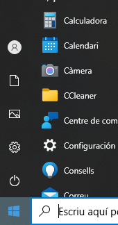
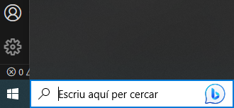
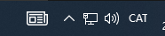
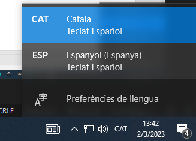
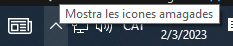
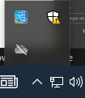
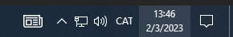
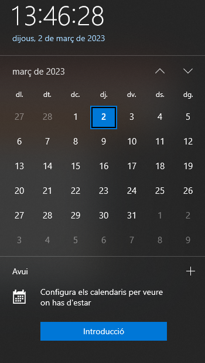
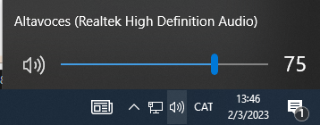

#  2. BARRA DE TAREAS
---

Se denomina barra de tareas a la que aparece en la parte inferior de la pantalla, y sirve para encontrar y controlar aplicaciones de diversos sistemas operativos.

---

#  Menú Windows y búsqueda rápida

En primer lugar, nos encontramos con el menú Windows, al que podemos acceder también pulsando la tecla Win

---

#  Búsqueda rápida

Podemos utilizar la combianción ``Win + S`` para ir a la caja de búsqueda de windows.

---

#  Teclado e idioma

Podemos tener configurados diferentes teclados por idioma, y esto nos puede dar muchos problemas como, por ejemplo, que algunas teclas no se escriban correctamente.

Podemos cambiarlo desde el menú o con Ctrl + Shift directamente.

---

#  Tareas

Las tareas son programas que tenemos abiertos. Las tareas de la derecha funcionan en segundo plano y están en marcha, aunque no las veamos en el escritorio.

Podemos identificar los ``programas abiertos`` porque tienen una línea azul debajo, que nos indica que hay abierta al menos una ventana de ese programa.

---

#  Abrir programa con atajos

Para abrirlos con el teclado, Win +número:

- WIN + 1 abrirá el primer programa por la izquierda
- WIN + 2 abrirá el segundo

Se comienza a contar por la izquierda

---

#  Tareas ocultas

En la flecha derecha podemos ver las tareas ocultas, generalmente son programas que están que funcionan en segundo plano, es decir, sin mostrar ninguna ventana.

Las podemos mostrar haciendo click en la flecha.

---

#  Fecha y hora

Podemos visualizar el calendario y futuras tareas.

Los eventos de agenda se sincronizará con las cuentas de Google (calendar) o de Microsoft que tengamos configuradas

---

#  Notificaciones (Windows 10)

Podemos abrirlas directamente con Win+A. Se pueden personalizar las notificaciones, y modificar ciertas configuraciones

---

#  Otros iconos

Podemos encontrar abajo a la derecha accesos directos a:

- Dispositivos USB
- Antivirus
- Actualizaciones
- Cnexión de Red

---

#  Volumen

En control de volumen podemos elegir el dispositivo de escucha, así como cambiar el volumen del sonido.

---

#  Cortana

Se trata de un asistente de voz que me permite dar órdenes al ordenador para que realice determinadas acciones o busque información.

Para ello necesitamos de un micrófono en el ordenador

Otros asistentes son

- Siri
- Alexa
- El asistente de Google

<im src="media/image8.png" id="image9">