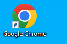
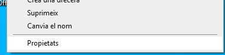
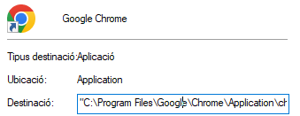
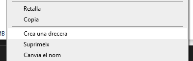
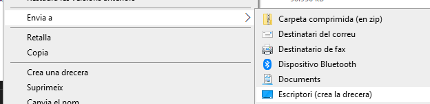
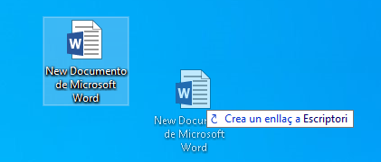

ACCESOS DIRECTOS

---

# Accesos directos

Me permiten acceder a archivos y carpetas que están en otros lugares del disco duro.

En general, cuando un programa se instala, se copia en una carpeta dentro del disco duro. Luego crea un acceso directo en el escritorio para abrirlo más fácilmente.

---

# Localizar el archivo original

1. Clic derecho encima del documento
2. Propiedades

---

---

# Crear un acceso directo

También puede crear accesos directos de escritorio para determinados archivos de Office o documentos.

---

#

1. Busca el documento o archivo para el que desea crear un acceso directo de escritorio.
2. Clic con el botón derecho en el nombre del documento y, a continuación, haga clic en Crear acceso directo.

---

# Enviar al escritorio

1. clic derecho en el archivo
2. ``Enviar a > escritorio`` (crear acceso directo).

---

# Arrastrando

Arrastrando el ícono de una carpeta con la tecla ``ALT`` apretada, podemos crear un acceso directo.

