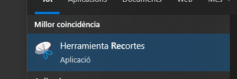
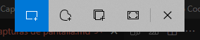
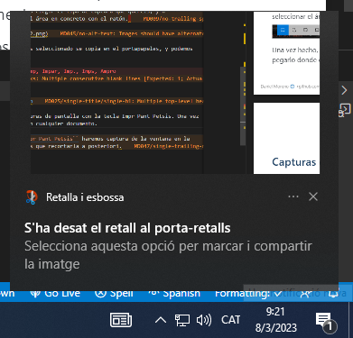
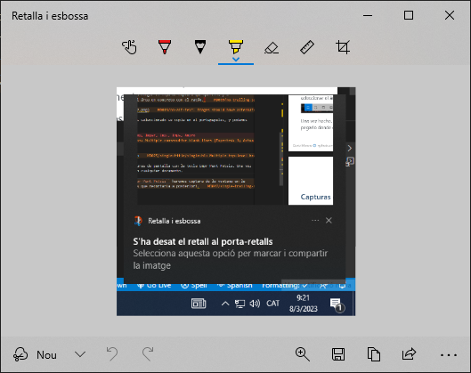

# CAPTURAS DE PANTALLA

---

# Capturas de pantalla

Las capturas de pantalla o ``screenshots`` nos permiten tomar fotografías de la pantalla actual, o parte de ella, para poder compartirla, guardarla o utilizarla en algún documento.

---

Vamos a ver las ``herramientas`` con las que podemos hacer capturas:

- La herramienta recortes
- La herramienta capturas de pantalla
- Capturas desde el teclado

---

# Herramienta recortes

Para usar la herramienta ``Recortes`` cuando tengas un mouse y un teclado:

Selecciona ``Inicio`` , escribe herramienta de ``recortes`` y selecciónala en los resultados de la búsqueda.

---

Para realizar una nueva captura de pantalla con el mismo modo que utilizaste la última vez, selecciona Nueva. O bien, para elegir el tipo de recorte que quieres, selecciona Modo (en versiones anteriores de Windows, la flecha situada junto a Nuevo) y elige un modo de captura. Cuando realices recortes de forma libre o rectangular, usa el mouse para seleccionar el área que quieres capturar.
---

Usa los botones Guardar y Copiar situados en la parte superior del recorte para guardarlo o copiarlo en el portapapeles.

Los modos de recorte disponibles son forma libre, rectangular, ventana y recorte de pantalla completa.

---

# Herramienta capturas de pantalla

Para lanzar la nueva herramienta de capturas de pantalla de Windows, debes pulsar a la vez las teclas ``Windows`` + ``Shift`` + ``S``.

En la parte superior podéis elegir el tipo de captura que queréis, y a continuación seleccionar el área en concreto con el ratón.

Podemos encontrar la captura a la derecha, en las notificaciones.

---

---

Una vez hecho, lo que hemos seleccionado se copia en el ``portapapeles``, y podemos pegarlo donde queramos.

---

También podemos ``editar`` la imagen capturada para recortarla o pintar encima de ella.

---

# Capturas desde el teclado

También podemos hacer capturas de pantalla con la tecla Impr Pant Petsis. Una vez pulsada, podemos pegarlo en cualquier documento.

Si pulsamos ``Alt`` + ``Impr Pant Petsis`` haremos captura de la ventana en la que estamos, y no tendremos que recortarla a posteriori.